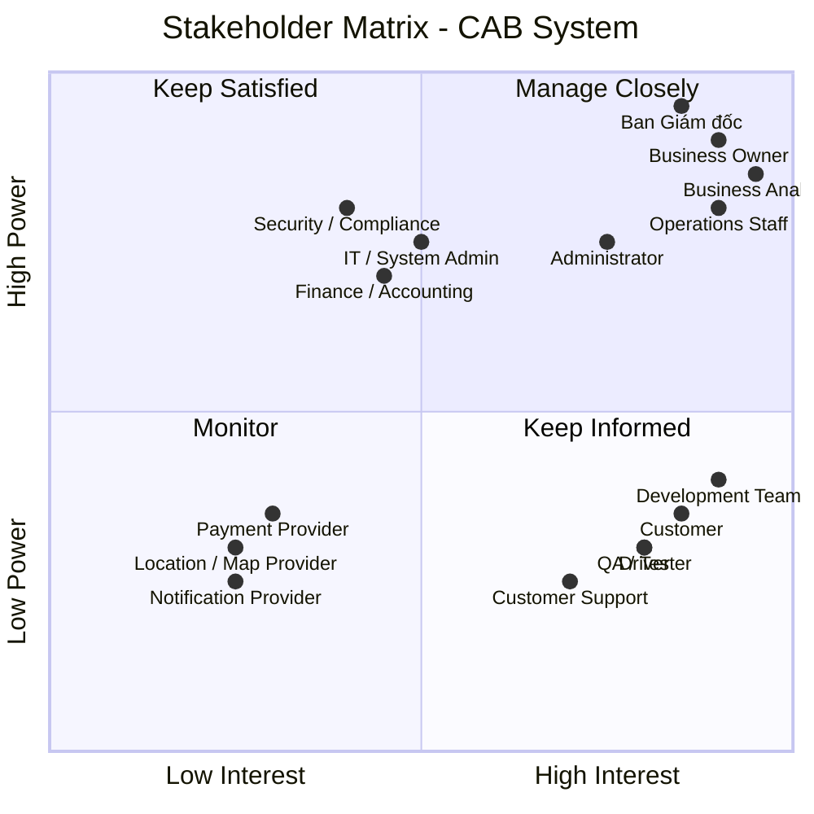

Bước 1 : đọc và phân tích yêu cầu sơ khởi của khách hàng ở giai đoạn 1 
# BƯỚC 1 – PHÂN TÍCH YÊU CẦU SƠ KHỞI

## 1. Mục tiêu dự án

Xây dựng **CAB System** – nền tảng đặt xe trực tuyến, quản lý toàn bộ vòng đời chuyến xe:

> **Tạo yêu cầu → Tìm tài xế → Phân công → Thực hiện chuyến → Tính cước → Thanh toán → Đánh giá → Báo cáo**

Hệ thống cần đáp ứng khả năng **mở rộng, tích hợp với hệ thống bên ngoài, bảo mật và triển khai từng phần**.

---

## 2. Phạm vi nghiệp vụ sơ bộ

| Nhóm | Phạm vi chính |
|---|---|
| **Customer** | Đăng ký, đăng nhập, cập nhật thông tin, đặt xe, theo dõi chuyến, thanh toán, xem lịch sử, đánh giá |
| **Driver** | Quản lý hồ sơ/phương tiện, trạng thái hoạt động, nhận/từ chối chuyến, cập nhật trạng thái và vị trí |
| **Operations** | Quản lý Customer, Driver, Vehicle, Trip; giám sát chuyến và xử lý sự cố |
| **Administration** | Phân quyền, quản lý chức năng nhạy cảm và audit |
| **Payment** | Tính cước, thanh toán tiền mặt và thanh toán điện tử |
| **Notification** | Gửi thông báo cho Customer và Driver |
| **Reporting** | Báo cáo chuyến, doanh thu, tỷ lệ hoàn thành, hủy và hiệu quả Driver |
| **Integration** | Payment Provider, Notification Provider, Location/Map Service |

---

## 3. Quy trình nghiệp vụ cốt lõi

```text
Customer
   │
   ▼
Tạo Booking
   │
   ▼
Tìm Driver phù hợp
   │
   ├── Driver từ chối/Timeout
   │          │
   │          └──────► Tìm Driver tiếp theo
   │
   ▼
Driver nhận chuyến
   │
   ▼
Thực hiện chuyến
   │
   ▼
Hoàn thành chuyến
   │
   ▼
Tính cước
   │
   ▼
Thanh toán
   │
   ▼
Đánh giá
   │
   ▼
Lưu lịch sử & Báo cáo
```

### Driver Matching

Đây là nghiệp vụ trọng tâm:

- Xác định Driver dựa trên **vị trí, trạng thái sẵn sàng và tiêu chí vận hành**.
- Ưu tiên Driver phù hợp và gần Customer.
- Nếu Driver **từ chối hoặc không phản hồi**, hệ thống tự động tìm Driver tiếp theo.
- Customer không cần tạo lại Booking.
- Nếu không tìm được Driver, hệ thống phải thông báo rõ ràng.

---

## 4. Yêu cầu chức năng chính

### Customer

- Đăng ký / đăng nhập.
- Quản lý thông tin cá nhân.
- Tạo Booking.
- Theo dõi Driver và trạng thái Trip.
- Xem lịch sử và cước.
- Thanh toán.
- Đánh giá Driver.

### Driver

- Quản lý hồ sơ và phương tiện.
- Cập nhật trạng thái sẵn sàng.
- Nhận / từ chối chuyến.
- Cập nhật trạng thái Trip.
- Cập nhật vị trí.

### Operations

- Quản lý Customer, Driver, Vehicle.
- Theo dõi Trip đang diễn ra.
- Xử lý Trip lỗi.
- Tra cứu giao dịch.
- Theo dõi hiệu quả hoạt động.

### Reporting & Audit

- Số lượng Trip.
- Doanh thu.
- Tỷ lệ hoàn thành.
- Tỷ lệ hủy.
- Hiệu quả Driver.
- Audit Log.

---

## 5. Yêu cầu phi chức năng

| Nhóm | Yêu cầu |
|---|---|
| **Scalability** | Có khả năng mở rộng độc lập khi tải tăng |
| **Availability** | Lỗi Payment/Notification không làm dừng toàn bộ hệ thống |
| **Security** | Bảo vệ dữ liệu cá nhân, phương tiện, vị trí và giao dịch |
| **Authorization** | Kiểm soát quyền truy cập chức năng quản trị |
| **Auditability** | Lưu vết các thao tác quan trọng |
| **Extensibility** | Có thể bổ sung dịch vụ, Payment Provider, Notification Provider |
| **Maintainability** | Hạn chế phụ thuộc giữa các thành phần |
| **Deployability** | Cho phép triển khai chức năng mới từng phần |

---

## 6. Business Rules sơ bộ

| ID | Business Rule |
|---|---|
| **BR-01** | Chỉ Driver đủ điều kiện và đang sẵn sàng mới được nhận chuyến. |
| **BR-02** | Driver phải phù hợp với loại xe/dịch vụ Customer yêu cầu. |
| **BR-03** | Hệ thống ưu tiên Driver phù hợp và gần Customer. |
| **BR-04** | Driver từ chối hoặc Timeout → hệ thống tìm Driver tiếp theo. |
| **BR-05** | Không tìm được Driver → thông báo Customer. |
| **BR-06** | Fare được xác định dựa trên loại dịch vụ và thông tin chuyến. |
| **BR-07** | Payment điện tử được xử lý thông qua External Payment Provider. |
| **BR-08** | CAB không lưu trực tiếp thông tin thẻ/tài khoản nhạy cảm. |
| **BR-09** | Customer chỉ được đánh giá sau khi Trip hoàn thành. |
| **BR-10** | Chức năng quản trị phải được kiểm soát bằng quyền. |
| **BR-11** | Các thao tác quan trọng phải được ghi nhận Audit Log. |

> **Lưu ý:** Các Business Rules trên mới là **sơ bộ**, cần được xác nhận với Stakeholder trước khi trở thành Baseline Requirement.

---

## 7. Các vấn đề cần làm rõ

| # | Open Issue / Question |
|---:|---|
| 1 | Công thức tính cước, phụ phí và giá tối thiểu là gì? |
| 2 | Tiêu chí và thuật toán ưu tiên Driver như thế nào? |
| 3 | Driver có bao nhiêu thời gian để phản hồi? |
| 4 | Chính sách hủy chuyến và phí hủy như thế nào? |
| 5 | Xử lý mất kết nối/GPS trong quá trình chuyến ra sao? |
| 6 | Payment thất bại, Timeout và Retry được xử lý thế nào? |
| 7 | Payment Provider và phương thức thanh toán nào được sử dụng? |
| 8 | Notification Channel nào được hỗ trợ trong MVP? |
| 9 | Thời gian lưu trữ Trip, Location, Payment và Audit Log? |
| 10 | SLA, Performance Target và quy mô tải dự kiến? |
| 11 | Mô hình Role/Permission của Operations và Administrator? |

---

## 8. Rủi ro chính

| Rủi ro | Mức độ |
|---|---|
| Fare Calculation chưa được xác định | 🔴 Cao |
| Driver Matching chưa có tiêu chí cụ thể | 🔴 Cao |
| Cancellation Policy chưa rõ | 🔴 Cao |
| Payment Provider chưa xác định | 🔴 Cao |
| Performance/SLA chưa xác định | 🔴 Cao |
| Realtime Location có thể tạo tải lớn | 🔴 Cao |
| Xử lý Network Failure chưa thống nhất | 🔴 Cao |
| Notification/Payment phụ thuộc hệ thống bên ngoài | 🟠 Trung bình - Cao |
| Data Retention chưa xác định | 🟠 Trung bình |

---

## 9. Kết luận của BA

**CAB System không chỉ là ứng dụng đặt xe mà là nền tảng quản lý toàn bộ vòng đời chuyến xe.**

Phạm vi nghiệp vụ chính đã tương đối rõ, tuy nhiên cần xác nhận các Business Rules quan trọng trước khi khóa Requirement, đặc biệt:

> **Fare → Driver Matching → Timeout → Cancellation → Payment Failure → Network Failure → Data Retention**

### Đề xuất bước tiếp theo

```text
Requirement Clarification Workshop
              ↓
Xác nhận Business Rules & Open Issues
              ↓
Use Case & Business Process
              ↓
Functional / Non-functional Requirements
              ↓
Acceptance Criteria
              ↓
Requirement Baseline
              ↓
Solution Design & Development
```

### Deliverables của giai đoạn phân tích

- [x] Scope & Business Context
- [x] Preliminary Functional Requirements
- [x] Preliminary Non-functional Requirements
- [x] Business Rules
- [x] Exception / Edge Cases
- [x] Open Questions
- [x] Risks & Dependencies
- [ ] Stakeholder Analysis
- [ ] Use Case Diagram
- [ ] Detailed Use Case Specification
- [ ] Acceptance Criteria
- [ ] Requirement Baseline

Bước 2 : Tìm ra và xác nhận các stalkholder trong đây, chia làm 2 cột, cột thứ 1: tên của stakeholder, cột thứ 2: vai trò của nó, Sau đó vẽ 1 ma trận tên stakeholder matrix cho biết sự ảnh hưởng tầm quan trọng vai trò của stakeholder trong hệ thống
# BƯỚC 2 – XÁC ĐỊNH STAKEHOLDER

## 1. Stakeholder List

| Stakeholder | Vai trò |
|---|---|
| **Ban Giám đốc (Management)** | Định hướng chiến lược, phê duyệt phạm vi, ngân sách và các quyết định quan trọng của dự án. |
| **Business Owner / CAB Business Team** | Đại diện nghiệp vụ, xác định mục tiêu kinh doanh và chịu trách nhiệm về sản phẩm. |
| **Business Analyst (BA)** | Thu thập, phân tích, làm rõ và quản lý yêu cầu; kết nối Business với đội phát triển. |
| **Customer** | Đăng ký, đặt xe, theo dõi chuyến, thanh toán, xem lịch sử và đánh giá tài xế. |
| **Driver** | Quản lý hồ sơ/phương tiện, nhận chuyến, cập nhật trạng thái và vị trí. |
| **Operations Staff** | Quản lý khách hàng, tài xế, phương tiện, chuyến đi và xử lý các trường hợp phát sinh. |
| **Administrator** | Quản lý tài khoản, phân quyền và thực hiện các thao tác quản trị nhạy cảm. |
| **Finance / Accounting** | Quản lý doanh thu, giao dịch, đối soát và nghiệp vụ thanh toán. |
| **IT / System Administrator** | Quản lý hạ tầng, môi trường triển khai và vận hành hệ thống. |
| **Development Team** | Thiết kế, phát triển, tích hợp và bảo trì hệ thống. |
| **QA / Tester** | Kiểm thử chức năng, tích hợp, hiệu năng và đảm bảo chất lượng. |
| **Payment Provider** | Cung cấp dịch vụ thanh toán điện tử và xử lý kết quả giao dịch. |
| **Notification Provider** | Cung cấp các kênh gửi thông báo như Push, SMS, Email. |
| **Location / Map Provider** | Cung cấp dữ liệu bản đồ, định vị, khoảng cách và hỗ trợ tính ETA. |
| **Security / Compliance** | Đảm bảo các yêu cầu về bảo mật, quyền riêng tư và tuân thủ. |
| **Customer Support / Call Center** | Tiếp nhận và hỗ trợ các vấn đề phát sinh từ khách hàng và tài xế. |

---

## 2. Stakeholder Matrix

**Mục đích:** Đánh giá stakeholder dựa trên hai tiêu chí:

- **Power / Influence:** Mức độ ảnh hưởng và khả năng ra quyết định.
- **Interest:** Mức độ quan tâm và tham gia vào dự án.



### 3. Phân nhóm Stakeholder

| Nhóm | Cách quản lý | Stakeholder chính |
|---|---|---|
| **Manage Closely** | Tham gia thường xuyên, trao đổi và xác nhận các quyết định quan trọng | Management, Business Owner, Operations, BA, Administrator |
| **Keep Satisfied** | Duy trì sự hài lòng, cập nhật các vấn đề có ảnh hưởng | Finance, IT, Security/Compliance |
| **Keep Informed** | Cập nhật thường xuyên, thu thập phản hồi | Customer, Driver, Development, QA, Customer Support |
| **Monitor** | Theo dõi khi phát sinh vấn đề hoặc yêu cầu tích hợp | Payment, Notification, Location/Map Provider |

### 4. Kết luận

> **Nhóm cần ưu tiên cao nhất là Management, Business Owner, Operations, BA và Administrator**, vì có mức độ ảnh hưởng và mức độ tham gia cao đối với phạm vi, quy trình và quyết định của CAB System.
>
> Trong giai đoạn phân tích, BA cần đặc biệt phối hợp với **Business Owner, Operations, Customer, Driver, Finance và IT/Security** để xác nhận Business Rules, quy trình nghiệp vụ và các yêu cầu còn chưa rõ.


