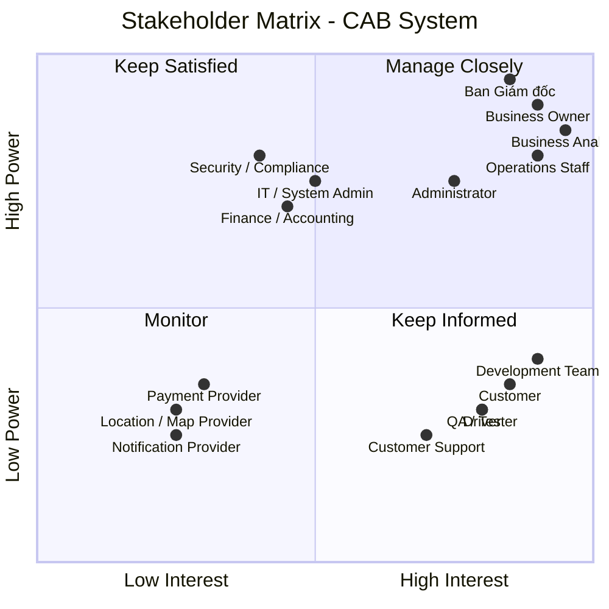
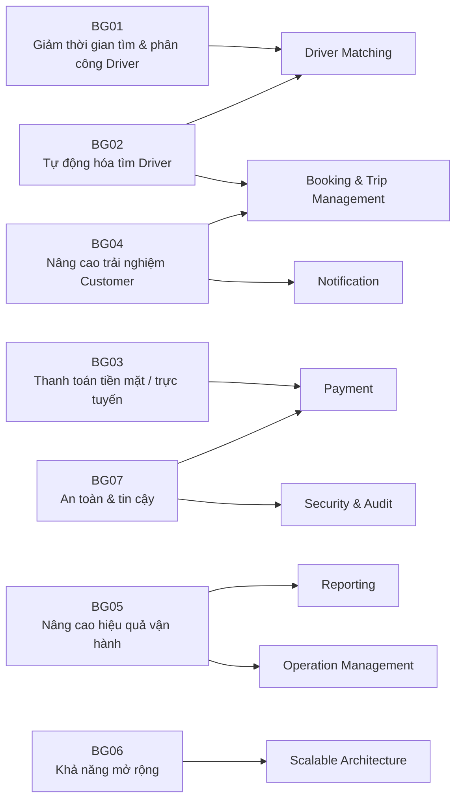
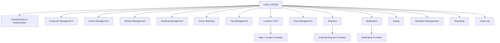
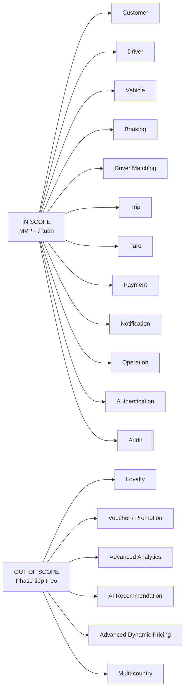
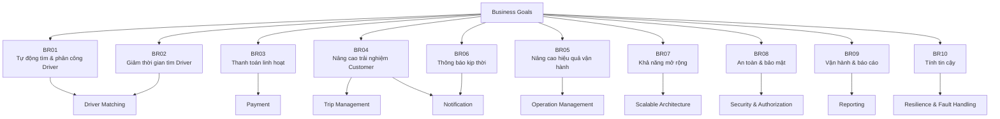
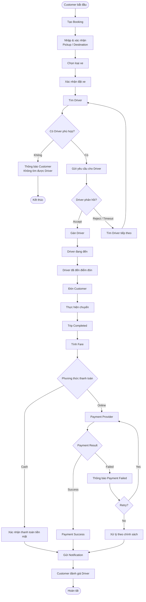
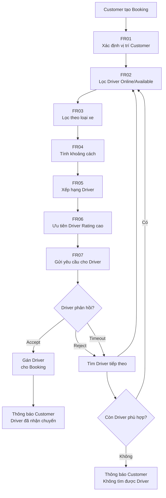
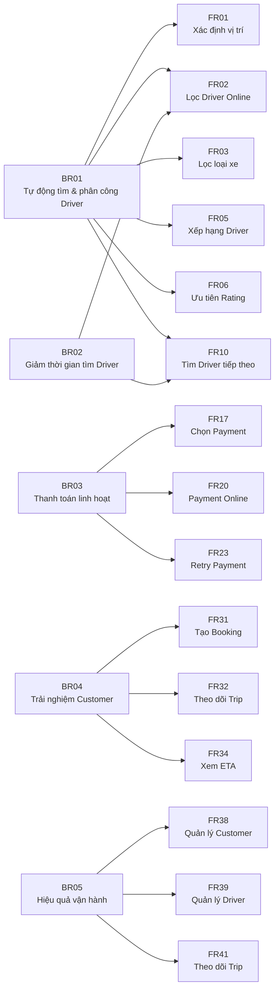
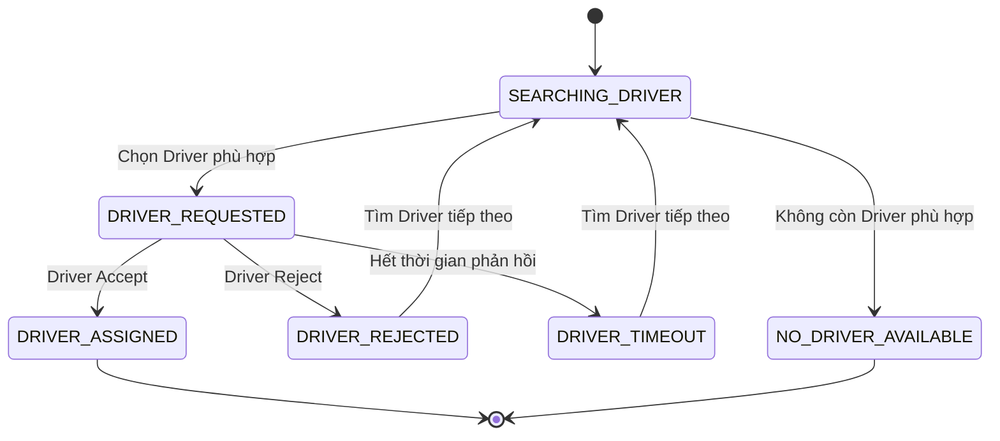

Bước 1 : đọc và phân tích yêu cầu sơ khởi của khách hàng ở giai đoạn 1 
# BƯỚC 1 – PHÂN TÍCH YÊU CẦU SƠ KHỞI

## 1. Mục tiêu dự án

Xây dựng **CAB System** – nền tảng đặt xe trực tuyến, quản lý toàn bộ vòng đời chuyến xe:

> **Tạo yêu cầu → Tìm tài xế → Phân công → Thực hiện chuyến → Tính cước → Thanh toán → Đánh giá → Báo cáo**

Hệ thống cần đáp ứng khả năng **mở rộng, tích hợp với hệ thống bên ngoài, bảo mật và triển khai từng phần**.

---

## 2. Phạm vi nghiệp vụ sơ bộ

| Nhóm | Phạm vi chính |
|---|---|
| **Customer** | Đăng ký, đăng nhập, cập nhật thông tin, đặt xe, theo dõi chuyến, thanh toán, xem lịch sử, đánh giá |
| **Driver** | Quản lý hồ sơ/phương tiện, trạng thái hoạt động, nhận/từ chối chuyến, cập nhật trạng thái và vị trí |
| **Operations** | Quản lý Customer, Driver, Vehicle, Trip; giám sát chuyến và xử lý sự cố |
| **Administration** | Phân quyền, quản lý chức năng nhạy cảm và audit |
| **Payment** | Tính cước, thanh toán tiền mặt và thanh toán điện tử |
| **Notification** | Gửi thông báo cho Customer và Driver |
| **Reporting** | Báo cáo chuyến, doanh thu, tỷ lệ hoàn thành, hủy và hiệu quả Driver |
| **Integration** | Payment Provider, Notification Provider, Location/Map Service |

---

## 3. Quy trình nghiệp vụ cốt lõi

```text
Customer
   │
   ▼
Tạo Booking
   │
   ▼
Tìm Driver phù hợp
   │
   ├── Driver từ chối/Timeout
   │          │
   │          └──────► Tìm Driver tiếp theo
   │
   ▼
Driver nhận chuyến
   │
   ▼
Thực hiện chuyến
   │
   ▼
Hoàn thành chuyến
   │
   ▼
Tính cước
   │
   ▼
Thanh toán
   │
   ▼
Đánh giá
   │
   ▼
Lưu lịch sử & Báo cáo
```

### Driver Matching

Đây là nghiệp vụ trọng tâm:

- Xác định Driver dựa trên **vị trí, trạng thái sẵn sàng và tiêu chí vận hành**.
- Ưu tiên Driver phù hợp và gần Customer.
- Nếu Driver **từ chối hoặc không phản hồi**, hệ thống tự động tìm Driver tiếp theo.
- Customer không cần tạo lại Booking.
- Nếu không tìm được Driver, hệ thống phải thông báo rõ ràng.

---

## 4. Yêu cầu chức năng chính

### Customer

- Đăng ký / đăng nhập.
- Quản lý thông tin cá nhân.
- Tạo Booking.
- Theo dõi Driver và trạng thái Trip.
- Xem lịch sử và cước.
- Thanh toán.
- Đánh giá Driver.

### Driver

- Quản lý hồ sơ và phương tiện.
- Cập nhật trạng thái sẵn sàng.
- Nhận / từ chối chuyến.
- Cập nhật trạng thái Trip.
- Cập nhật vị trí.

### Operations

- Quản lý Customer, Driver, Vehicle.
- Theo dõi Trip đang diễn ra.
- Xử lý Trip lỗi.
- Tra cứu giao dịch.
- Theo dõi hiệu quả hoạt động.

### Reporting & Audit

- Số lượng Trip.
- Doanh thu.
- Tỷ lệ hoàn thành.
- Tỷ lệ hủy.
- Hiệu quả Driver.
- Audit Log.

---

## 5. Yêu cầu phi chức năng

| Nhóm | Yêu cầu |
|---|---|
| **Scalability** | Có khả năng mở rộng độc lập khi tải tăng |
| **Availability** | Lỗi Payment/Notification không làm dừng toàn bộ hệ thống |
| **Security** | Bảo vệ dữ liệu cá nhân, phương tiện, vị trí và giao dịch |
| **Authorization** | Kiểm soát quyền truy cập chức năng quản trị |
| **Auditability** | Lưu vết các thao tác quan trọng |
| **Extensibility** | Có thể bổ sung dịch vụ, Payment Provider, Notification Provider |
| **Maintainability** | Hạn chế phụ thuộc giữa các thành phần |
| **Deployability** | Cho phép triển khai chức năng mới từng phần |

---

## 6. Business Rules sơ bộ

| ID | Business Rule |
|---|---|
| **BR-01** | Chỉ Driver đủ điều kiện và đang sẵn sàng mới được nhận chuyến. |
| **BR-02** | Driver phải phù hợp với loại xe/dịch vụ Customer yêu cầu. |
| **BR-03** | Hệ thống ưu tiên Driver phù hợp và gần Customer. |
| **BR-04** | Driver từ chối hoặc Timeout → hệ thống tìm Driver tiếp theo. |
| **BR-05** | Không tìm được Driver → thông báo Customer. |
| **BR-06** | Fare được xác định dựa trên loại dịch vụ và thông tin chuyến. |
| **BR-07** | Payment điện tử được xử lý thông qua External Payment Provider. |
| **BR-08** | CAB không lưu trực tiếp thông tin thẻ/tài khoản nhạy cảm. |
| **BR-09** | Customer chỉ được đánh giá sau khi Trip hoàn thành. |
| **BR-10** | Chức năng quản trị phải được kiểm soát bằng quyền. |
| **BR-11** | Các thao tác quan trọng phải được ghi nhận Audit Log. |

> **Lưu ý:** Các Business Rules trên mới là **sơ bộ**, cần được xác nhận với Stakeholder trước khi trở thành Baseline Requirement.

---

## 7. Các vấn đề cần làm rõ

| # | Open Issue / Question |
|---:|---|
| 1 | Công thức tính cước, phụ phí và giá tối thiểu là gì? |
| 2 | Tiêu chí và thuật toán ưu tiên Driver như thế nào? |
| 3 | Driver có bao nhiêu thời gian để phản hồi? |
| 4 | Chính sách hủy chuyến và phí hủy như thế nào? |
| 5 | Xử lý mất kết nối/GPS trong quá trình chuyến ra sao? |
| 6 | Payment thất bại, Timeout và Retry được xử lý thế nào? |
| 7 | Payment Provider và phương thức thanh toán nào được sử dụng? |
| 8 | Notification Channel nào được hỗ trợ trong MVP? |
| 9 | Thời gian lưu trữ Trip, Location, Payment và Audit Log? |
| 10 | SLA, Performance Target và quy mô tải dự kiến? |
| 11 | Mô hình Role/Permission của Operations và Administrator? |

---

## 8. Rủi ro chính

| Rủi ro | Mức độ |
|---|---|
| Fare Calculation chưa được xác định | 🔴 Cao |
| Driver Matching chưa có tiêu chí cụ thể | 🔴 Cao |
| Cancellation Policy chưa rõ | 🔴 Cao |
| Payment Provider chưa xác định | 🔴 Cao |
| Performance/SLA chưa xác định | 🔴 Cao |
| Realtime Location có thể tạo tải lớn | 🔴 Cao |
| Xử lý Network Failure chưa thống nhất | 🔴 Cao |
| Notification/Payment phụ thuộc hệ thống bên ngoài | 🟠 Trung bình - Cao |
| Data Retention chưa xác định | 🟠 Trung bình |

---

## 9. Kết luận của BA

**CAB System không chỉ là ứng dụng đặt xe mà là nền tảng quản lý toàn bộ vòng đời chuyến xe.**

Phạm vi nghiệp vụ chính đã tương đối rõ, tuy nhiên cần xác nhận các Business Rules quan trọng trước khi khóa Requirement, đặc biệt:

> **Fare → Driver Matching → Timeout → Cancellation → Payment Failure → Network Failure → Data Retention**

### Đề xuất bước tiếp theo

```text
Requirement Clarification Workshop
              ↓
Xác nhận Business Rules & Open Issues
              ↓
Use Case & Business Process
              ↓
Functional / Non-functional Requirements
              ↓
Acceptance Criteria
              ↓
Requirement Baseline
              ↓
Solution Design & Development
```

### Deliverables của giai đoạn phân tích

- [x] Scope & Business Context
- [x] Preliminary Functional Requirements
- [x] Preliminary Non-functional Requirements
- [x] Business Rules
- [x] Exception / Edge Cases
- [x] Open Questions
- [x] Risks & Dependencies
- [ ] Stakeholder Analysis
- [ ] Use Case Diagram
- [ ] Detailed Use Case Specification
- [ ] Acceptance Criteria
- [ ] Requirement Baseline

Bước 2 : Tìm ra và xác nhận các stalkholder trong đây, chia làm 2 cột, cột thứ 1: tên của stakeholder, cột thứ 2: vai trò của nó, Sau đó vẽ 1 ma trận tên stakeholder matrix cho biết sự ảnh hưởng tầm quan trọng vai trò của stakeholder trong hệ thống
# BƯỚC 2 – XÁC ĐỊNH STAKEHOLDER

## 1. Stakeholder List

| Stakeholder | Vai trò |
|---|---|
| **Ban Giám đốc (Management)** | Định hướng chiến lược, phê duyệt phạm vi, ngân sách và các quyết định quan trọng của dự án. |
| **Business Owner / CAB Business Team** | Đại diện nghiệp vụ, xác định mục tiêu kinh doanh và chịu trách nhiệm về sản phẩm. |
| **Business Analyst (BA)** | Thu thập, phân tích, làm rõ và quản lý yêu cầu; kết nối Business với đội phát triển. |
| **Customer** | Đăng ký, đặt xe, theo dõi chuyến, thanh toán, xem lịch sử và đánh giá tài xế. |
| **Driver** | Quản lý hồ sơ/phương tiện, nhận chuyến, cập nhật trạng thái và vị trí. |
| **Operations Staff** | Quản lý khách hàng, tài xế, phương tiện, chuyến đi và xử lý các trường hợp phát sinh. |
| **Administrator** | Quản lý tài khoản, phân quyền và thực hiện các thao tác quản trị nhạy cảm. |
| **Finance / Accounting** | Quản lý doanh thu, giao dịch, đối soát và nghiệp vụ thanh toán. |
| **IT / System Administrator** | Quản lý hạ tầng, môi trường triển khai và vận hành hệ thống. |
| **Development Team** | Thiết kế, phát triển, tích hợp và bảo trì hệ thống. |
| **QA / Tester** | Kiểm thử chức năng, tích hợp, hiệu năng và đảm bảo chất lượng. |
| **Payment Provider** | Cung cấp dịch vụ thanh toán điện tử và xử lý kết quả giao dịch. |
| **Notification Provider** | Cung cấp các kênh gửi thông báo như Push, SMS, Email. |
| **Location / Map Provider** | Cung cấp dữ liệu bản đồ, định vị, khoảng cách và hỗ trợ tính ETA. |
| **Security / Compliance** | Đảm bảo các yêu cầu về bảo mật, quyền riêng tư và tuân thủ. |
| **Customer Support / Call Center** | Tiếp nhận và hỗ trợ các vấn đề phát sinh từ khách hàng và tài xế. |

---

## 2. Stakeholder Matrix

**Mục đích:** Đánh giá stakeholder dựa trên hai tiêu chí:

- **Power / Influence:** Mức độ ảnh hưởng và khả năng ra quyết định.
- **Interest:** Mức độ quan tâm và tham gia vào dự án.



### 3. Phân nhóm Stakeholder

| Nhóm | Cách quản lý | Stakeholder chính |
|---|---|---|
| **Manage Closely** | Tham gia thường xuyên, trao đổi và xác nhận các quyết định quan trọng | Management, Business Owner, Operations, BA, Administrator |
| **Keep Satisfied** | Duy trì sự hài lòng, cập nhật các vấn đề có ảnh hưởng | Finance, IT, Security/Compliance |
| **Keep Informed** | Cập nhật thường xuyên, thu thập phản hồi | Customer, Driver, Development, QA, Customer Support |
| **Monitor** | Theo dõi khi phát sinh vấn đề hoặc yêu cầu tích hợp | Payment, Notification, Location/Map Provider |

### 4. Kết luận

> **Nhóm cần ưu tiên cao nhất là Management, Business Owner, Operations, BA và Administrator**, vì có mức độ ảnh hưởng và mức độ tham gia cao đối với phạm vi, quy trình và quyết định của CAB System.
>
> Trong giai đoạn phân tích, BA cần đặc biệt phối hợp với **Business Owner, Operations, Customer, Driver, Finance và IT/Security** để xác nhận Business Rules, quy trình nghiệp vụ và các yêu cầu còn chưa rõ.
Bước 3: xác định  bussines goal ,BG01 là cái gì, BG02 là cái gì, làm giảm thời gian tự động tìm tài xế ,mục đích hệ thống có chức năng tìm tài xế, hỗ trợ cho phép thanh toán bằng tiền mặt hoặc trực tuyến 
# BƯỚC 3 – XÁC ĐỊNH BUSINESS GOALS

## 1. Business Goals

| ID | Business Goal | Mục tiêu |
|---|---|---|
| **BG01** | **Giảm thời gian tìm và phân công tài xế** | Tự động hóa quá trình tìm kiếm và phân công tài xế phù hợp, giảm thời gian chờ của khách hàng và hạn chế phân công thủ công. |
| **BG02** | **Tự động hóa quy trình tìm tài xế** | Tự động tìm, ưu tiên và phân công tài xế dựa trên vị trí, trạng thái sẵn sàng và các tiêu chí vận hành. |
| **BG03** | **Đa dạng hóa phương thức thanh toán** | Hỗ trợ khách hàng thanh toán bằng **tiền mặt hoặc thanh toán điện tử**. |
| **BG04** | **Nâng cao trải nghiệm khách hàng** | Cho phép khách hàng theo dõi trạng thái chuyến, thông tin tài xế và thời gian dự kiến đến. |
| **BG05** | **Nâng cao hiệu quả vận hành** | Hỗ trợ quản lý khách hàng, tài xế, phương tiện, chuyến đi, giao dịch và báo cáo. |
| **BG06** | **Xây dựng nền tảng CAB có khả năng mở rộng** | Cho phép mở rộng số lượng người dùng, tài xế, chuyến đi và bổ sung các dịch vụ mới trong tương lai. |
| **BG07** | **Đảm bảo an toàn và tin cậy** | Bảo vệ dữ liệu người dùng, vị trí và giao dịch; hạn chế ảnh hưởng khi Payment hoặc Notification gặp lỗi. |

---

## 2. Ưu tiên Business Goals

| Priority | Business Goal | Mức độ |
|---|---|---|
| **P1** | BG01 – Giảm thời gian tìm và phân công tài xế | 🔴 Critical |
| **P1** | BG02 – Tự động hóa tìm tài xế | 🔴 Critical |
| **P1** | BG03 – Hỗ trợ thanh toán tiền mặt / trực tuyến | 🔴 Critical |
| **P1** | BG04 – Nâng cao trải nghiệm khách hàng | 🔴 Critical |
| **P2** | BG05 – Nâng cao hiệu quả vận hành | 🟠 High |
| **P2** | BG06 – Khả năng mở rộng | 🟠 High |
| **P2** | BG07 – An toàn và tin cậy | 🟠 High |

---

## 3. Liên kết Business Goal với chức năng hệ thống



---

## 4. Kết luận

> **Ba Business Goals cốt lõi của dự án CAB:**
>
> - **BG01:** Giảm thời gian tìm và phân công tài xế.
> - **BG02:** Tự động hóa quá trình tìm và phân công tài xế.
> - **BG03:** Hỗ trợ thanh toán linh hoạt bằng tiền mặt và trực tuyến.

Các Business Goals là cơ sở để BA tiếp tục xác định:

**Business Goal → Business Requirement → Functional Requirement → Use Case → Acceptance Criteria**

bước 4 : xác định cái phạm vi yêu cầu để thực hiện, ví dụ, quản lý khách hàng, quản lý tài xế, xác định các mô đun cơ bản , quản lý trong bảng MBB,xác định nên làm cái gì và các cái gì không nên làm, làm theo dạng markdow
# BƯỚC 4 – XÁC ĐỊNH PHẠM VI VÀ MODULE HỆ THỐNG

## 1. Mục tiêu

Xác định phạm vi triển khai **CAB System trong 7 tuần**, bao gồm:

- Các chức năng bắt buộc phải thực hiện.
- Các chức năng nên thực hiện nếu còn thời gian.
- Các chức năng có thể phát triển ở giai đoạn sau.
- Các chức năng chưa thực hiện trong phạm vi hiện tại.

---

## 2. Phạm vi hệ thống

### 2.1. In Scope – Trong phạm vi

| # | Module | Phạm vi chính |
|---:|---|---|
| 1 | **Quản lý Customer** | Đăng ký, đăng nhập, cập nhật thông tin, xem lịch sử chuyến |
| 2 | **Quản lý Driver** | Hồ sơ, trạng thái hoạt động, nhận/từ chối chuyến |
| 3 | **Quản lý Vehicle** | Thông tin phương tiện, loại xe, trạng thái phương tiện |
| 4 | **Booking Management** | Tạo, xem và theo dõi yêu cầu đặt xe |
| 5 | **Driver Matching** | Tìm, ưu tiên và phân công Driver tự động |
| 6 | **Trip Management** | Quản lý trạng thái và vòng đời chuyến đi |
| 7 | **Location / ETA** | Cập nhật vị trí Driver và hỗ trợ tính ETA |
| 8 | **Fare Management** | Tính và xác định cước chuyến |
| 9 | **Payment** | Thanh toán tiền mặt và thanh toán điện tử |
| 10 | **Notification** | Thông báo trạng thái Booking, Trip và Payment |
| 11 | **Rating** | Customer đánh giá Driver sau chuyến |
| 12 | **Operation Management** | Theo dõi và xử lý Customer, Driver, Vehicle, Trip |
| 13 | **Reporting** | Báo cáo chuyến, doanh thu, hoàn thành, hủy |
| 14 | **Authentication & Authorization** | Đăng nhập, xác thực và phân quyền |
| 15 | **Audit Log** | Lưu vết các thao tác quan trọng |

---

## 3. Module cơ bản của hệ thống



---

# 4. Phân loại phạm vi theo MBB

> **MBB = Must / Should / Could / Won't**

| MBB | Module / Chức năng | Phạm vi thực hiện |
|---|---|---|
| **M – Must** | Customer Management | Đăng ký, đăng nhập, cập nhật hồ sơ |
| **M – Must** | Driver Management | Hồ sơ, trạng thái sẵn sàng, nhận/từ chối chuyến |
| **M – Must** | Vehicle Management | Quản lý thông tin phương tiện |
| **M – Must** | Booking Management | Tạo và quản lý Booking |
| **M – Must** | Driver Matching | Tự động tìm và phân công Driver |
| **M – Must** | Trip Management | Quản lý trạng thái chuyến |
| **M – Must** | Fare Management | Tính cước chuyến |
| **M – Must** | Payment | Tiền mặt và thanh toán điện tử |
| **M – Must** | Notification | Thông báo các trạng thái quan trọng |
| **M – Must** | Authentication / Authorization | Xác thực và phân quyền |
| **M – Must** | Audit Log | Lưu vết thao tác quan trọng |
| **S – Should** | Location / ETA | Theo dõi vị trí và thời gian dự kiến |
| **S – Should** | Rating | Đánh giá Driver sau chuyến |
| **S – Should** | Operation Management | Dashboard và xử lý các trường hợp Trip lỗi |
| **S – Should** | Basic Reporting | Báo cáo chuyến, doanh thu, hoàn thành, hủy |
| **C – Could** | Advanced Reporting | Dashboard phân tích chuyên sâu |
| **C – Could** | Advanced Driver Ranking | Xếp hạng Driver nâng cao |
| **C – Could** | Notification đa kênh nâng cao | Mở rộng nhiều provider/kênh |
| **C – Could** | Khuyến mãi / Voucher | Coupon, promotion |
| **C – Could** | Loyalty / Membership | Điểm thưởng, hạng thành viên |
| **W – Won't** | Tính năng ngoài phạm vi MVP | Chưa triển khai trong giai đoạn 7 tuần |

---

## 5. Những nội dung KHÔNG nên làm trong giai đoạn hiện tại

Để đảm bảo tiến độ **7 tuần**, các chức năng sau nên đưa ra ngoài phạm vi MVP:

| Chức năng | Lý do |
|---|---|
| **Loyalty / Membership** | Không ảnh hưởng đến quy trình đặt xe cốt lõi |
| **Voucher / Promotion** | Cần thêm nhiều Business Rules và logic tính giá |
| **Advanced Analytics** | Không phải chức năng bắt buộc để vận hành MVP |
| **AI Driver Recommendation** | Có thể phát triển sau khi có đủ dữ liệu thực tế |
| **Dynamic Pricing nâng cao** | Fare Policy hiện chưa được khách hàng chốt |
| **Multi-service phức tạp** | Chưa cần thiết trong phiên bản đầu |
| **Nhiều Payment Provider** | MVP chỉ cần tích hợp Provider được thống nhất |
| **Nhiều Notification Provider** | Thiết kế mở rộng nhưng chưa cần triển khai tất cả |
| **International / Multi-country** | Chưa có yêu cầu kinh doanh |
| **Advanced Customer Loyalty** | Không thuộc quy trình đặt xe cốt lõi |

> **Lưu ý:** "Won't" không có nghĩa là hệ thống không bao giờ hỗ trợ. Đây là các chức năng **chưa thực hiện trong phạm vi phiên bản hiện tại** và có thể đưa vào các phase tiếp theo.

---

# 6. Phạm vi ưu tiên cho 7 tuần

### Phase 1 – Core Foundation

- Authentication
- Customer Management
- Driver Management
- Vehicle Management
- Booking Management

### Phase 2 – Core Ride

- Driver Matching
- Trip Management
- Location / ETA
- Notification

### Phase 3 – Payment & Operation

- Fare Management
- Payment
- Operation Management
- Rating

### Phase 4 – Reporting & Stabilization

- Basic Reporting
- Audit Log
- Integration Testing
- Performance Testing
- Security Testing
- Bug Fixing & Deployment

---

## 7. Scope Boundary



---

# 8. Kết luận phạm vi

### Must Have – Bắt buộc

> **Customer → Driver → Vehicle → Booking → Driver Matching → Trip → Fare → Payment → Notification → Operation → Authentication → Audit**

Đây là **core scope** cần ưu tiên để đảm bảo hệ thống có thể vận hành được trong 7 tuần.

### Should Have – Nên có

> **Location / ETA → Rating → Operation Dashboard → Basic Reporting**

Các chức năng này nâng cao trải nghiệm và hiệu quả vận hành nhưng có thể điều chỉnh ưu tiên theo tiến độ.

### Could Have – Có thể phát triển sau

> **Advanced Reporting → Voucher → Loyalty → AI Recommendation → Advanced Dynamic Pricing**

### Won't Have – Chưa thực hiện

> Các tính năng không ảnh hưởng đến **core booking flow** và chưa có yêu cầu kinh doanh rõ ràng sẽ được đưa sang **Phase 2 / Future Release**.

---

## 9. Nguyên tắc kiểm soát Scope

> **Ưu tiên hoàn thành End-to-End Core Flow trước:**

**Customer tạo Booking → Driver Matching → Driver nhận chuyến → Trip Completed → Fare → Payment → Notification**

Nếu tiến độ bị ảnh hưởng, các chức năng thuộc nhóm **Could Have** sẽ được cắt giảm trước, **không cắt các chức năng Must Have của Core Flow**.
Bước 5 : sau khi xác nhận với khách hàng rồi chuyển các yêu cầu thành bussines requirement, mối busines requirement kí hiệu là BG, BG01 là gì, BG02 là gì, BG03 là gì, lập 1 bảng  cột thứ nhất là mã với số thứ tự,cột thứ 2 là tên,cột thứ 3 là diễn giải ra 
# BƯỚC 5 – XÁC ĐỊNH BUSINESS REQUIREMENTS

## 1. Business Requirements

Sau khi phân tích và xác nhận yêu cầu với khách hàng, các mục tiêu kinh doanh được chuyển thành các **Business Requirements (BR)** để làm cơ sở cho việc phân rã thành Functional Requirements và Use Cases.

| Mã | Tên Business Requirement | Diễn giải |
|---|---|---|
| **BR01** | **Tự động tìm và phân công tài xế** | Hệ thống phải tự động tìm kiếm và phân công tài xế phù hợp dựa trên vị trí, trạng thái sẵn sàng và các tiêu chí vận hành đã xác định. |
| **BR02** | **Giảm thời gian tìm tài xế** | Hệ thống phải giảm thời gian từ khi khách hàng tạo yêu cầu đến khi tìm được tài xế; nếu tài xế từ chối hoặc không phản hồi, hệ thống phải tiếp tục tìm tài xế khác. |
| **BR03** | **Hỗ trợ thanh toán linh hoạt** | Hệ thống phải cho phép khách hàng thanh toán bằng tiền mặt hoặc phương thức thanh toán điện tử thông qua nhà cung cấp thanh toán bên ngoài. |
| **BR04** | **Nâng cao trải nghiệm khách hàng** | Hệ thống phải cho phép khách hàng theo dõi trạng thái chuyến, thông tin tài xế, thời gian dự kiến đến, số tiền phải trả và lịch sử chuyến đi. |
| **BR05** | **Nâng cao hiệu quả vận hành** | Hệ thống phải hỗ trợ nhân viên vận hành quản lý khách hàng, tài xế, phương tiện, chuyến đi, giao dịch và xử lý các trường hợp phát sinh. |
| **BR06** | **Cung cấp thông báo kịp thời** | Hệ thống phải thông báo cho khách hàng và tài xế về các sự kiện quan trọng như tiếp nhận Booking, nhận chuyến, tài xế đến điểm đón, hoàn thành chuyến và kết quả thanh toán. |
| **BR07** | **Đảm bảo khả năng mở rộng** | Hệ thống phải có khả năng mở rộng số lượng khách hàng, tài xế và chuyến đi; đồng thời cho phép bổ sung dịch vụ, phương thức thanh toán và kênh thông báo trong tương lai. |
| **BR08** | **Đảm bảo an toàn và bảo mật** | Hệ thống phải bảo vệ thông tin cá nhân, thông tin phương tiện, dữ liệu vị trí và dữ liệu giao dịch; đồng thời kiểm soát quyền truy cập các chức năng quản trị. |
| **BR09** | **Đảm bảo khả năng vận hành và báo cáo** | Hệ thống phải cung cấp dữ liệu và báo cáo về số lượng chuyến, doanh thu, tỷ lệ hoàn thành, tỷ lệ hủy và hiệu quả hoạt động của tài xế. |
| **BR10** | **Đảm bảo tính tin cậy của hệ thống** | Lỗi tại Payment hoặc Notification không được làm gián đoạn toàn bộ hệ thống đặt xe; hệ thống phải có cơ chế xử lý lỗi phù hợp. |

---

## 2. Business Requirement Priority

| Mã | Priority | Mức độ |
|---|---|---|
| **BR01** | P1 | Critical |
| **BR02** | P1 | Critical |
| **BR03** | P1 | Critical |
| **BR04** | P1 | Critical |
| **BR05** | P1 | Critical |
| **BR06** | P1 | Critical |
| **BR07** | P2 | High |
| **BR08** | P1 | Critical |
| **BR09** | P2 | High |
| **BR10** | P1 | Critical |

---

## 3. Phân rã Business Requirement



---

## 4. Kết luận

Các **Business Requirements (BR)** là cơ sở để tiếp tục phân rã thành:

```text
Business Goal (BG)
        ↓
Business Requirement (BR)
        ↓
Functional Requirement (FR)
        ↓
Use Case (UC)
        ↓
Acceptance Criteria (AC)
        ↓
Test Case
```

> **Quy ước mã:**
>
> - **BGxx** → Business Goal
> - **BRxx** → Business Requirement
> - **FRxx** → Functional Requirement
> - **NFRxx** → Non-functional Requirement
> - **UCxx** → Use Case
> - **ACxx** → Acceptance Criteria
bước 6: xây dựng các cái bussines proess, ví dụ grab, đầu tiên là tạo chuyến đi, xác nhận điểm đón, điểm đến, tìm tài xế, tìm không ra thì thông báo, nếu tìm ra thì đợi tài xế chấp nhận, còn không chấp nhận thì thông báo, lưu ý grab là ví dụ thôi, làm theo dạng markdow 
# BƯỚC 6 – XÂY DỰNG BUSINESS PROCESS

## 1. Mục tiêu

Xây dựng quy trình nghiệp vụ của **CAB System** từ khi khách hàng tạo yêu cầu đặt xe đến khi chuyến đi hoàn tất.

### Business Process tổng quát

```text
Customer tạo yêu cầu
        ↓
Xác nhận điểm đón & điểm đến
        ↓
Chọn loại xe
        ↓
Tạo Booking
        ↓
Hệ thống tìm Driver
        ↓
 ┌──────┴──────┐
 ↓             ↓
Tìm thấy     Không tìm thấy
 ↓             ↓
Gửi yêu cầu   Thông báo Customer
cho Driver    "Không có Driver"
 ↓
Driver phản hồi
 ┌──────┴─────────┐
 ↓                ↓
Accept          Reject/Timeout
 ↓                ↓
Gán chuyến      Tìm Driver tiếp theo
 ↓
Driver đến điểm đón
 ↓
Đón Customer
 ↓
Thực hiện chuyến
 ↓
Hoàn thành
 ↓
Tính cước
 ↓
Thanh toán
 ↓
Đánh giá
 ↓
Kết thúc
```

---

# 2. Business Process – Đặt xe

## BP01 – Tạo yêu cầu đặt xe

**Actor:** Customer

### Luồng chính

1. Customer đăng nhập hệ thống.
2. Customer nhập **điểm đón**.
3. Customer nhập **điểm đến**.
4. Hệ thống xác nhận thông tin vị trí.
5. Customer lựa chọn **loại xe/dịch vụ**.
6. Hệ thống hiển thị thông tin đặt xe.
7. Customer xác nhận đặt xe.
8. Hệ thống tạo Booking.
9. Booking chuyển sang trạng thái **SEARCHING_DRIVER**.
10. Hệ thống bắt đầu tìm Driver.

### Ngoại lệ

- Điểm đón không hợp lệ.
- Điểm đến không hợp lệ.
- Không xác định được vị trí.
- Loại xe không khả dụng.
- Customer mất kết nối khi tạo Booking.

---

# 3. Business Process – Tìm và phân công Driver

## BP02 – Driver Matching

Đây là **Business Process quan trọng nhất** của hệ thống.

### Luồng chính

1. Hệ thống nhận Booking.
2. Xác định danh sách Driver phù hợp.
3. Kiểm tra:
   - Driver đang Online/Available.
   - Driver có loại xe phù hợp.
   - Driver nằm trong khu vực phù hợp.
   - Các tiêu chí vận hành khác.
4. Hệ thống xếp hạng Driver.
5. Chọn Driver ưu tiên.
6. Gửi yêu cầu chuyến đến Driver.
7. Chờ Driver phản hồi.

### Driver Accept

```text
Driver Accept
     ↓
Gán Driver cho Booking
     ↓
Thông báo Customer
     ↓
Driver bắt đầu đến điểm đón
```

### Driver Reject / Timeout

```text
Driver Reject / Timeout
          ↓
Hủy yêu cầu với Driver hiện tại
          ↓
Tìm Driver tiếp theo
          ↓
Có Driver?
    ┌─────┴─────┐
   Có          Không
    ↓             ↓
Gửi yêu cầu    Thông báo
Driver tiếp    Customer
theo           không tìm thấy Driver
```

### Quy tắc quan trọng

> Customer **không cần tạo lại Booking** khi Driver từ chối hoặc không phản hồi.

---

# 4. Business Process – Thực hiện chuyến

## BP03 – Trip Execution

Sau khi Driver nhận chuyến:

```text
DRIVER_ASSIGNED
       ↓
DRIVER_ARRIVING
       ↓
DRIVER_ARRIVED
       ↓
PASSENGER_PICKED_UP
       ↓
IN_PROGRESS
       ↓
COMPLETED
```

### Chi tiết

| Trạng thái | Ý nghĩa |
|---|---|
| **DRIVER_ASSIGNED** | Driver đã nhận và được gán vào Booking |
| **DRIVER_ARRIVING** | Driver đang di chuyển đến điểm đón |
| **DRIVER_ARRIVED** | Driver đã đến điểm đón |
| **PASSENGER_PICKED_UP** | Customer đã lên xe |
| **IN_PROGRESS** | Chuyến đang được thực hiện |
| **COMPLETED** | Chuyến đã hoàn thành |

---

# 5. Business Process – Tính cước

## BP04 – Fare Calculation

Khi Trip hoàn thành:

```text
Trip Completed
      ↓
Thu thập thông tin Trip
      ↓
Xác định loại dịch vụ
      ↓
Tính Fare
      ↓
Xác định số tiền phải trả
      ↓
Hiển thị Fare cho Customer
```

### Các yếu tố có thể ảnh hưởng đến Fare

- Loại dịch vụ.
- Khoảng cách.
- Thời gian.
- Phụ phí.
- Chính sách giá của doanh nghiệp.

> **Lưu ý:** Công thức tính cước cụ thể vẫn cần được xác nhận với Business Owner.

---

# 6. Business Process – Thanh toán

## BP05 – Payment

Customer có thể lựa chọn:

### Thanh toán tiền mặt

```text
Fare được xác định
       ↓
Customer thanh toán tiền mặt
       ↓
Driver / System xác nhận
       ↓
Payment = SUCCESS
```

### Thanh toán điện tử

```text
Fare được xác định
       ↓
Customer chọn Payment Online
       ↓
CAB gửi yêu cầu Payment Provider
       ↓
Payment Provider xử lý
       ↓
 ┌─────────────┴─────────────┐
 ↓                           ↓
SUCCESS                    FAILED
 ↓                           ↓
Cập nhật Payment          Thông báo Customer
 ↓                           ↓
Hoàn tất                    Retry / Xử lý
```

### Quy tắc

> CAB không lưu trực tiếp thông tin nhạy cảm của thẻ hoặc tài khoản thanh toán.

---

# 7. Business Process – Notification

## BP06 – Notification

Hệ thống gửi thông báo dựa trên các sự kiện nghiệp vụ.

| Event | Customer | Driver |
|---|:---:|:---:|
| Booking được tiếp nhận | ✅ | |
| Có yêu cầu chuyến mới | | ✅ |
| Driver nhận chuyến | ✅ | |
| Driver đến điểm đón | ✅ | |
| Trip thay đổi trạng thái | ✅ | ✅ |
| Trip hoàn thành | ✅ | |
| Payment thành công | ✅ | |
| Payment thất bại | ✅ | |
| Không tìm được Driver | ✅ | |

### Kiến trúc nghiệp vụ

```text
Business Event
      ↓
Notification Service
      ↓
Notification Provider
      ↓
Push / SMS / Email
```

---

# 8. Business Process – Rating

## BP07 – Đánh giá Driver

```text
Trip = COMPLETED
       ↓
Customer nhận yêu cầu đánh giá
       ↓
Customer đánh giá Driver
       ↓
Hệ thống lưu Rating
       ↓
Kết thúc
```

### Business Rule

> Customer chỉ được đánh giá Driver sau khi Trip hoàn thành.

---

# 9. Business Process tổng thể



---

# 10. Business Process – Exception Handling

| Process | Exception | Hệ thống xử lý |
|---|---|---|
| Booking | Pickup/Destination không hợp lệ | Yêu cầu Customer nhập lại |
| Booking | Mất kết nối | Cho phép retry theo trạng thái Booking |
| Driver Matching | Không có Driver | Thông báo Customer |
| Driver Matching | Driver Reject | Tìm Driver tiếp theo |
| Driver Matching | Driver Timeout | Tìm Driver tiếp theo |
| Driver Matching | Driver mất kết nối | Loại khỏi danh sách phù hợp và tìm Driver khác |
| Trip | Customer hủy | Xử lý theo Cancellation Policy |
| Trip | Driver hủy | Tìm Driver khác hoặc xử lý theo Policy |
| Trip | Mất GPS | Thông báo và xử lý theo chính sách |
| Payment | Payment Failed | Thông báo Customer và cho phép Retry |
| Payment | Payment Timeout | Kiểm tra lại trạng thái giao dịch |
| Notification | Gửi thất bại | Retry theo Notification Policy |

---

# 11. Các Business Process chính

| ID | Business Process | Mục tiêu |
|---|---|---|
| **BP01** | Create Booking | Tạo yêu cầu đặt xe |
| **BP02** | Driver Matching | Tìm và phân công Driver |
| **BP03** | Trip Execution | Thực hiện và cập nhật trạng thái Trip |
| **BP04** | Fare Calculation | Tính cước chuyến |
| **BP05** | Payment | Xử lý thanh toán |
| **BP06** | Notification | Gửi thông báo theo sự kiện |
| **BP07** | Rating | Customer đánh giá Driver |
| **BP08** | Operation Management | Giám sát và xử lý Trip |
| **BP09** | Reporting | Tổng hợp dữ liệu vận hành |

---

# 12. Kết luận

Business Process cốt lõi của CAB System:

> **Create Booking → Driver Matching → Driver Assignment → Trip Execution → Fare Calculation → Payment → Notification → Rating**

Trong đó **Driver Matching** là quy trình trọng tâm cần ưu tiên phân tích chi tiết vì ảnh hưởng trực tiếp đến mục tiêu **BG01 – giảm thời gian tìm tài xế** và **BR01/BR02 – tự động tìm và phân công Driver**.

Các quy trình như **Fare Calculation, Cancellation, Payment Failure và Network Failure** cần tiếp tục xác nhận Business Rules với khách hàng trước khi chuyển sang thiết kế chi tiết.
bước 7: bussines requirement phân rã ra thành các functional requirement phân rã yêu cầu dịch vụ, thiết kế các functional requirement, ví dụ FR1 tìm vị trí của khách hàng, FR2 chọn những thằng tài xế online, FR3 chọn loại xe, ưu tiên chọn những tài xế đánh giá cao, làm theo dạng markdow
# BƯỚC 7 – PHÂN RÃ BUSINESS REQUIREMENT THÀNH FUNCTIONAL REQUIREMENT

## 1. Mục tiêu

Phân rã các **Business Requirements (BR)** thành các **Functional Requirements (FR)** cụ thể để xác định hệ thống **phải làm gì** nhằm đáp ứng yêu cầu nghiệp vụ.

### Luồng phân rã

```text
Business Goal (BG)
        ↓
Business Requirement (BR)
        ↓
Functional Requirement (FR)
        ↓
Use Case
        ↓
Acceptance Criteria
```

---

# 2. Phân rã BR01 – Tự động tìm và phân công Driver

### Business Requirement

**BR01:** Hệ thống phải tự động tìm kiếm và phân công Driver phù hợp dựa trên vị trí, trạng thái sẵn sàng và các tiêu chí vận hành.

### Functional Requirements

| Mã | Functional Requirement | Diễn giải |
|---|---|---|
| **FR01** | Xác định vị trí Customer | Hệ thống phải xác định vị trí/điểm đón mà Customer cung cấp. |
| **FR02** | Xác định danh sách Driver Online | Hệ thống phải lọc các Driver đang ở trạng thái sẵn sàng nhận chuyến. |
| **FR03** | Lọc Driver theo loại xe | Hệ thống phải chỉ lựa chọn Driver có phương tiện phù hợp với loại xe Customer yêu cầu. |
| **FR04** | Xác định khoảng cách Driver | Hệ thống phải tính khoảng cách giữa Driver và điểm đón của Customer. |
| **FR05** | Ưu tiên Driver phù hợp | Hệ thống phải sắp xếp Driver dựa trên các tiêu chí được doanh nghiệp xác định. |
| **FR06** | Ưu tiên Driver có đánh giá tốt | Hệ thống có thể ưu tiên Driver có Rating cao khi các điều kiện khác tương đương. |
| **FR07** | Gửi yêu cầu chuyến đến Driver | Hệ thống phải gửi thông tin Booking đến Driver được lựa chọn. |
| **FR08** | Nhận phản hồi Driver | Hệ thống phải ghi nhận kết quả Accept/Reject của Driver. |
| **FR09** | Xử lý Driver không phản hồi | Hệ thống phải xác định Timeout khi Driver không phản hồi trong thời gian quy định. |
| **FR10** | Tìm Driver tiếp theo | Khi Driver Reject hoặc Timeout, hệ thống phải tiếp tục tìm Driver phù hợp tiếp theo. |
| **FR11** | Thông báo không tìm được Driver | Khi không còn Driver phù hợp, hệ thống phải thông báo cho Customer. |

---

# 3. Phân rã BR02 – Giảm thời gian tìm Driver

### Business Requirement

**BR02:** Hệ thống phải giảm thời gian từ khi Customer tạo Booking đến khi tìm được Driver.

### Functional Requirements

| Mã | Functional Requirement | Diễn giải |
|---|---|---|
| **FR12** | Tự động kích hoạt Driver Matching | Hệ thống phải bắt đầu tìm Driver ngay sau khi Booking được xác nhận. |
| **FR13** | Tìm kiếm Driver theo vị trí | Hệ thống phải ưu tiên các Driver gần điểm đón. |
| **FR14** | Xử lý Timeout tự động | Hệ thống phải tự động chuyển sang Driver tiếp theo khi hết thời gian phản hồi. |
| **FR15** | Theo dõi trạng thái tìm Driver | Customer phải biết hệ thống đang trong quá trình tìm Driver. |
| **FR16** | Cập nhật kết quả tìm Driver | Hệ thống phải cập nhật trạng thái khi Driver được phân công hoặc không tìm được Driver. |

---

# 4. Phân rã BR03 – Hỗ trợ thanh toán linh hoạt

### Business Requirement

**BR03:** Hệ thống phải hỗ trợ thanh toán bằng tiền mặt và thanh toán điện tử.

### Functional Requirements

| Mã | Functional Requirement | Diễn giải |
|---|---|---|
| **FR17** | Chọn phương thức thanh toán | Customer được lựa chọn Cash hoặc Online Payment. |
| **FR18** | Tính số tiền phải thanh toán | Hệ thống phải xác định Fare sau khi Trip hoàn thành. |
| **FR19** | Xử lý thanh toán tiền mặt | Hệ thống phải ghi nhận kết quả thanh toán tiền mặt. |
| **FR20** | Tạo giao dịch thanh toán điện tử | Hệ thống phải gửi yêu cầu thanh toán đến Payment Provider. |
| **FR21** | Nhận kết quả thanh toán | Hệ thống phải ghi nhận Success/Failed/Timeout từ Payment Provider. |
| **FR22** | Thông báo thanh toán thất bại | Hệ thống phải thông báo cho Customer khi thanh toán không thành công. |
| **FR23** | Cho phép Retry Payment | Hệ thống phải cho phép xử lý lại thanh toán theo chính sách doanh nghiệp. |
| **FR24** | Lưu thông tin giao dịch | Hệ thống phải lưu thông tin giao dịch cần thiết nhưng không lưu dữ liệu thanh toán nhạy cảm. |

---

# 5. Phân rã BR04 – Nâng cao trải nghiệm Customer

### Business Requirement

**BR04:** Hệ thống phải cho phép Customer theo dõi và quản lý toàn bộ chuyến đi.

### Functional Requirements

| Mã | Functional Requirement | Diễn giải |
|---|---|---|
| **FR25** | Đăng ký tài khoản | Customer có thể tạo tài khoản. |
| **FR26** | Đăng nhập | Customer có thể đăng nhập và xác thực. |
| **FR27** | Quản lý thông tin cá nhân | Customer có thể xem và cập nhật hồ sơ. |
| **FR28** | Nhập điểm đón | Customer có thể nhập/xác nhận điểm đón. |
| **FR29** | Nhập điểm đến | Customer có thể nhập/xác nhận điểm đến. |
| **FR30** | Chọn loại xe | Customer có thể lựa chọn loại xe/dịch vụ. |
| **FR31** | Tạo Booking | Customer có thể gửi yêu cầu đặt xe. |
| **FR32** | Theo dõi trạng thái Trip | Customer có thể xem trạng thái hiện tại của chuyến. |
| **FR33** | Xem thông tin Driver | Customer có thể xem thông tin Driver được phân công. |
| **FR34** | Xem ETA | Hệ thống hiển thị thời gian dự kiến Driver đến điểm đón. |
| **FR35** | Xem lịch sử Trip | Customer có thể xem lịch sử các chuyến đã thực hiện. |
| **FR36** | Xem Fare | Customer có thể xem số tiền phải trả cho Trip. |
| **FR37** | Đánh giá Driver | Customer có thể đánh giá Driver sau khi Trip hoàn thành. |

---

# 6. Phân rã BR05 – Nâng cao hiệu quả vận hành

### Business Requirement

**BR05:** Hệ thống phải cung cấp công cụ quản lý và giám sát cho bộ phận Operations.

### Functional Requirements

| Mã | Functional Requirement | Diễn giải |
|---|---|---|
| **FR38** | Quản lý Customer | Operations có thể xem và quản lý thông tin Customer. |
| **FR39** | Quản lý Driver | Operations có thể quản lý hồ sơ và trạng thái Driver. |
| **FR40** | Quản lý Vehicle | Operations có thể quản lý thông tin phương tiện. |
| **FR41** | Theo dõi Trip | Operations có thể xem các Trip đang diễn ra. |
| **FR42** | Theo dõi trạng thái Driver | Operations có thể kiểm tra trạng thái hoạt động của Driver. |
| **FR43** | Xử lý Trip lỗi | Operations có thể hỗ trợ xử lý các trường hợp Trip phát sinh lỗi. |
| **FR44** | Tra cứu giao dịch | Operations có thể tra cứu lịch sử giao dịch. |

---

# 7. Phân rã BR06 – Cung cấp Notification

### Business Requirement

**BR06:** Hệ thống phải gửi thông báo kịp thời cho Customer và Driver.

### Functional Requirements

| Mã | Functional Requirement | Diễn giải |
|---|---|---|
| **FR45** | Gửi Notification Booking | Thông báo khi Booking được tiếp nhận. |
| **FR46** | Gửi Notification Driver | Thông báo cho Driver khi có chuyến mới. |
| **FR47** | Thông báo Driver nhận chuyến | Thông báo cho Customer khi Driver Accept. |
| **FR48** | Thông báo Driver đến | Thông báo cho Customer khi Driver đến điểm đón. |
| **FR49** | Thông báo hoàn thành Trip | Thông báo khi Trip hoàn thành. |
| **FR50** | Thông báo Payment | Thông báo kết quả thanh toán. |
| **FR51** | Hỗ trợ nhiều Notification Channel | Hệ thống có khả năng tích hợp Push/SMS/Email hoặc kênh khác. |
| **FR52** | Retry Notification | Hệ thống phải có cơ chế xử lý khi gửi Notification thất bại. |

---

# 8. Phân rã BR07 – Khả năng mở rộng

### Business Requirement

**BR07:** Hệ thống phải có khả năng mở rộng và dễ dàng bổ sung các dịch vụ mới.

### Functional Requirements

| Mã | Functional Requirement | Diễn giải |
|---|---|---|
| **FR53** | Quản lý loại dịch vụ | Hệ thống cho phép quản lý nhiều loại dịch vụ/loại xe. |
| **FR54** | Hỗ trợ nhiều Payment Provider | Có khả năng tích hợp thêm Payment Provider trong tương lai. |
| **FR55** | Hỗ trợ nhiều Notification Provider | Có khả năng thay đổi hoặc bổ sung Notification Provider. |
| **FR56** | Tách biệt các chức năng nghiệp vụ | Các module nghiệp vụ có thể phát triển và mở rộng độc lập. |

---

# 9. Phân rã BR08 – An toàn và bảo mật

### Business Requirement

**BR08:** Hệ thống phải bảo vệ dữ liệu và kiểm soát quyền truy cập.

### Functional Requirements

| Mã | Functional Requirement | Diễn giải |
|---|---|---|
| **FR57** | Authentication | Xác thực Customer, Driver và Staff trước khi sử dụng chức năng yêu cầu đăng nhập. |
| **FR58** | Authorization | Kiểm soát quyền truy cập theo Role/Permission. |
| **FR59** | Bảo vệ dữ liệu cá nhân | Kiểm soát việc truy cập và sử dụng thông tin cá nhân. |
| **FR60** | Bảo vệ dữ liệu vị trí | Kiểm soát quyền truy cập dữ liệu vị trí Driver. |
| **FR61** | Audit Log | Ghi nhận các thao tác quản trị quan trọng. |

---

# 10. Phân rã BR09 – Reporting

### Business Requirement

**BR09:** Hệ thống phải cung cấp dữ liệu phục vụ quản lý và đánh giá hoạt động.

### Functional Requirements

| Mã | Functional Requirement | Diễn giải |
|---|---|---|
| **FR62** | Báo cáo số lượng Trip | Thống kê số lượng Trip theo khoảng thời gian. |
| **FR63** | Báo cáo doanh thu | Thống kê doanh thu từ các Trip. |
| **FR64** | Báo cáo tỷ lệ hoàn thành | Thống kê tỷ lệ Trip hoàn thành. |
| **FR65** | Báo cáo tỷ lệ hủy | Thống kê tỷ lệ Trip bị hủy. |
| **FR66** | Báo cáo hiệu quả Driver | Thống kê các chỉ số hoạt động của Driver. |

---

# 11. Phân rã BR10 – Tính tin cậy của hệ thống

### Business Requirement

**BR10:** Lỗi của Payment hoặc Notification không được làm dừng toàn bộ hệ thống.

### Functional Requirements

| Mã | Functional Requirement | Diễn giải |
|---|---|---|
| **FR67** | Xử lý Payment Failure | Hệ thống phải xử lý trạng thái Payment thất bại mà không làm mất Trip. |
| **FR68** | Xử lý Payment Timeout | Hệ thống phải xử lý trường hợp Payment Provider không phản hồi. |
| **FR69** | Retry Payment | Cho phép thực hiện lại Payment theo chính sách. |
| **FR70** | Xử lý Notification Failure | Lỗi Notification không được làm gián đoạn quy trình Booking/Trip. |
| **FR71** | Retry Notification | Hệ thống có thể gửi lại Notification thất bại. |

---

# 12. Tổng hợp Functional Requirements

| BR | Nhóm chức năng | FR |
|---|---|---|
| **BR01** | Driver Matching | FR01 – FR11 |
| **BR02** | Tối ưu thời gian tìm Driver | FR12 – FR16 |
| **BR03** | Payment | FR17 – FR24 |
| **BR04** | Customer Experience | FR25 – FR37 |
| **BR05** | Operations | FR38 – FR44 |
| **BR06** | Notification | FR45 – FR52 |
| **BR07** | Scalability & Extensibility | FR53 – FR56 |
| **BR08** | Security & Authorization | FR57 – FR61 |
| **BR09** | Reporting | FR62 – FR66 |
| **BR10** | Reliability | FR67 – FR71 |

---

# 13. Ví dụ chi tiết – Driver Matching

Đây là nhóm Functional Requirements cần ưu tiên phân tích sâu nhất:



---

# 14. Traceability – BR → FR



---

# 15. Kết luận

Sau Bước 7, yêu cầu đã được phân rã theo cấu trúc:

```text
Business Goal
      ↓
Business Requirement
      ↓
Functional Requirement
      ↓
Use Case
      ↓
Acceptance Criteria
      ↓
Test Case
```

Trong đó, nhóm **Driver Matching** cần được ưu tiên đặc tả chi tiết vì liên quan trực tiếp đến mục tiêu quan trọng của CAB:

> **Xác định vị trí Customer → Lọc Driver Online → Lọc loại xe → Tính khoảng cách → Xếp hạng Driver → Ưu tiên Driver phù hợp → Gửi yêu cầu → Accept / Reject / Timeout → Tìm Driver tiếp theo → Thông báo Customer.**

> **Lưu ý:** Việc “ưu tiên Driver có Rating cao” hiện nên được xem là **đề xuất nghiệp vụ cần xác nhận với khách hàng**, chưa nên coi là Business Rule chính thức nếu khách hàng chưa phê duyệt.
bước 8 : thiết kế Business rule, và thiết kế Accession, ví dụ các tài xế sẫn sàng mới được nhận chuyến,quá thời hạn tài xế không chịu access thì sẽ restar qua thằng tài xế tiếp theo, làm theo dạng markdow 
# BƯỚC 8 – THIẾT KẾ BUSINESS RULE & ACCEPTANCE CRITERIA

## 1. Mục tiêu

Xác định các **Business Rules (BRL)** và **Acceptance Criteria (AC)** cho các Functional Requirements đã được phân rã ở Bước 7.

```text
Business Requirement
        ↓
Functional Requirement
        ↓
Business Rule
        ↓
Acceptance Criteria
        ↓
Test Case
```

---

# 2. Business Rules

## 2.1. Driver Matching Rules

| Mã | Business Rule | Diễn giải |
|---|---|---|
| **BRL01** | Driver phải ở trạng thái Available | Chỉ Driver đang sẵn sàng nhận chuyến mới được đưa vào danh sách tìm kiếm. |
| **BRL02** | Driver phải phù hợp loại xe | Driver chỉ được đề xuất nếu phương tiện đáp ứng loại xe/dịch vụ Customer yêu cầu. |
| **BRL03** | Driver phải đáp ứng điều kiện vận hành | Driver phải đáp ứng các điều kiện hoạt động do doanh nghiệp quy định. |
| **BRL04** | Ưu tiên Driver phù hợp và gần Customer | Hệ thống phải ưu tiên các Driver đáp ứng điều kiện và có vị trí phù hợp với điểm đón. |
| **BRL05** | Driver chỉ nhận một Booking tại một thời điểm | Khi Driver đã được gán Booking, Driver không được đồng thời nhận Booking khác. |
| **BRL06** | Driver phải phản hồi trong thời gian quy định | Driver phải Accept hoặc Reject Booking trong khoảng thời gian được cấu hình. |
| **BRL07** | Driver Timeout được xem là không phản hồi | Nếu Driver không phản hồi trước thời hạn, Booking được chuyển sang Driver tiếp theo. |
| **BRL08** | Driver Reject → tìm Driver tiếp theo | Nếu Driver từ chối, hệ thống không yêu cầu Customer tạo lại Booking. |
| **BRL09** | Không tìm được Driver → thông báo Customer | Khi không còn Driver phù hợp, hệ thống phải thông báo rõ cho Customer. |
| **BRL10** | Không gửi trùng Booking cho cùng Driver | Hệ thống không gửi lại cùng một yêu cầu cho Driver đã Reject hoặc Timeout trong cùng vòng tìm kiếm. |

---

# 3. Booking Rules

| Mã | Business Rule | Diễn giải |
|---|---|---|
| **BRL11** | Booking phải có Pickup | Customer phải cung cấp điểm đón hợp lệ. |
| **BRL12** | Booking phải có Destination | Customer phải cung cấp điểm đến hợp lệ. |
| **BRL13** | Booking phải có Service Type | Customer phải lựa chọn loại xe/dịch vụ trước khi tạo Booking. |
| **BRL14** | Một Booking chỉ có một trạng thái hiện tại | Hệ thống phải đảm bảo trạng thái Booking nhất quán. |
| **BRL15** | Booking được tạo mới phải bắt đầu Driver Matching | Sau khi Booking được xác nhận, hệ thống tự động bắt đầu tìm Driver. |

---

# 4. Trip Rules

| Mã | Business Rule | Diễn giải |
|---|---|---|
| **BRL16** | Chỉ Driver được phân công mới được thực hiện Trip | Driver khác không được cập nhật trạng thái Trip. |
| **BRL17** | Trip phải tuân thủ thứ tự trạng thái | Driver phải cập nhật trạng thái theo trình tự nghiệp vụ được quy định. |
| **BRL18** | Driver phải đến điểm đón trước khi bắt đầu Trip | Driver không được chuyển sang trạng thái thực hiện Trip nếu chưa xác nhận đón Customer. |
| **BRL19** | Trip chỉ được hoàn thành khi đủ điều kiện | Trip chỉ chuyển sang COMPLETED khi Driver hoàn tất chuyến theo quy định. |
| **BRL20** | Trip Completed không được tiếp tục thực hiện | Trip đã hoàn thành không thể quay lại trạng thái đang thực hiện. |

---

# 5. Payment Rules

| Mã | Business Rule | Diễn giải |
|---|---|---|
| **BRL21** | Fare phải được xác định trước khi thanh toán | Hệ thống phải xác định số tiền Customer cần thanh toán. |
| **BRL22** | Hỗ trợ Cash và Online Payment | Customer có thể lựa chọn phương thức thanh toán được doanh nghiệp hỗ trợ. |
| **BRL23** | Online Payment phải thông qua Payment Provider | CAB không trực tiếp xử lý thông tin thanh toán nhạy cảm. |
| **BRL24** | Không lưu thông tin thẻ nhạy cảm | CAB không được lưu trực tiếp số thẻ hoặc thông tin xác thực thanh toán nhạy cảm. |
| **BRL25** | Payment Failed phải được ghi nhận | Hệ thống phải lưu trạng thái giao dịch thất bại và thông báo Customer. |
| **BRL26** | Payment Retry theo chính sách | Customer được phép thực hiện lại thanh toán nếu chính sách doanh nghiệp cho phép. |

---

# 6. Notification Rules

| Mã | Business Rule | Diễn giải |
|---|---|---|
| **BRL27** | Booking được tiếp nhận phải có Notification | Customer phải được thông báo khi hệ thống tiếp nhận Booking. |
| **BRL28** | Driver được đề xuất phải nhận Notification | Driver phù hợp phải được thông báo khi có Booking mới. |
| **BRL29** | Driver Accept phải thông báo Customer | Customer phải nhận được thông tin Driver đã nhận chuyến. |
| **BRL30** | Driver đến điểm đón phải thông báo Customer | Customer phải được thông báo khi Driver xác nhận đã đến. |
| **BRL31** | Payment Result phải thông báo Customer | Customer phải nhận được kết quả thanh toán. |
| **BRL32** | Notification Failure không làm dừng Trip | Lỗi Notification không được làm gián đoạn Booking hoặc Trip. |

---

# 7. Security & Authorization Rules

| Mã | Business Rule | Diễn giải |
|---|---|---|
| **BRL33** | User phải được xác thực | Customer, Driver và Staff phải đăng nhập trước khi sử dụng chức năng yêu cầu tài khoản. |
| **BRL34** | Chức năng phải kiểm tra quyền | User chỉ được thực hiện chức năng mà Role của mình được cấp quyền. |
| **BRL35** | Chức năng nhạy cảm phải được phân quyền | Các thao tác quản trị quan trọng chỉ dành cho Role được cấp quyền. |
| **BRL36** | Thao tác quan trọng phải được Audit | Các thao tác quản trị và thay đổi dữ liệu quan trọng phải được ghi nhận Audit Log. |

---

# 8. Acceptance Criteria

## AC01 – Driver phải Available

**Functional Requirement:** FR02 – Xác định Driver Online/Available

### Given
Driver có trạng thái:
- Available
- Offline
- Busy

### When
Customer tạo Booking.

### Then
Hệ thống chỉ đưa Driver **Available** vào danh sách Driver có thể nhận chuyến.

```text
Available → Có thể được chọn
Offline   → Không được chọn
Busy      → Không được chọn
```

---

## AC02 – Driver phải phù hợp loại xe

**Functional Requirement:** FR03 – Lọc Driver theo loại xe

### Given
Customer yêu cầu một loại xe cụ thể.

### When
Hệ thống thực hiện Driver Matching.

### Then
Hệ thống chỉ lựa chọn Driver có phương tiện phù hợp với loại xe Customer yêu cầu.

---

## AC03 – Ưu tiên Driver phù hợp

**Functional Requirement:** FR05 – Ưu tiên Driver phù hợp

### Given
Có nhiều Driver Available và đáp ứng điều kiện.

### When
Hệ thống thực hiện Driver Matching.

### Then
Hệ thống phải xếp hạng Driver theo các tiêu chí ưu tiên đã được doanh nghiệp cấu hình.

> **Lưu ý:** Thứ tự ưu tiên cụ thể cần được khách hàng xác nhận.

---

# 9. Acceptance Criteria – Driver Accept

## AC04 – Driver Accept Booking

**Functional Requirement:** FR08 – Nhận phản hồi Driver

### Given
Driver đang Available và nhận được Booking.

### When
Driver chọn **Accept** trong thời gian quy định.

### Then

1. Hệ thống ghi nhận Driver đã Accept.
2. Booking được gán cho Driver.
3. Driver chuyển sang trạng thái phù hợp, ví dụ `BUSY/ON_TRIP`.
4. Các Driver khác không được tiếp tục nhận Booking này.
5. Customer nhận được Notification.
6. Booking chuyển sang trạng thái `DRIVER_ASSIGNED`.

---

# 10. Acceptance Criteria – Driver Reject

## AC05 – Driver Reject Booking

**Functional Requirement:** FR10 – Tìm Driver tiếp theo

### Given
Driver nhận được Booking.

### When
Driver chọn **Reject**.

### Then

1. Hệ thống ghi nhận Reject.
2. Driver không được gán vào Booking.
3. Hệ thống tìm Driver phù hợp tiếp theo.
4. Customer không cần tạo lại Booking.
5. Booking tiếp tục ở trạng thái tìm Driver.

```text
Driver Reject
      ↓
Ghi nhận Reject
      ↓
Tìm Driver tiếp theo
      ↓
Có Driver?
   ┌──┴──┐
   ↓     ↓
  Có    Không
   ↓      ↓
Gửi     Thông báo
Booking Customer
```

---

# 11. Acceptance Criteria – Driver Timeout

## AC06 – Driver không phản hồi

**Functional Requirement:** FR09 – Xử lý Driver Timeout

### Given
Hệ thống đã gửi Booking cho Driver.

### When
Driver không Accept hoặc Reject trước thời hạn phản hồi.

### Then

1. Hệ thống xác định Driver đã `TIMEOUT`.
2. Booking không được gán cho Driver đó.
3. Hệ thống chuyển sang tìm Driver tiếp theo.
4. Customer không cần tạo lại Booking.
5. Hệ thống ghi nhận lịch sử Timeout.

```text
Send Booking
     ↓
Wait Response
     ↓
Timeout?
     ↓
YES
     ↓
Driver = TIMEOUT
     ↓
Tìm Driver tiếp theo
     ↓
Nếu không còn Driver
     ↓
Thông báo Customer
```

> **Thời gian Timeout cụ thể** cần được khách hàng xác nhận, ví dụ: 15 giây, 20 giây hoặc 30 giây.

---

# 12. Acceptance Criteria – Không tìm được Driver

## AC07 – No Driver Available

**Functional Requirement:** FR11 – Thông báo không tìm được Driver

### Given
Customer đã tạo Booking.

### When
Hệ thống không tìm thấy Driver phù hợp hoặc tất cả Driver đã Reject/Timeout.

### Then

1. Booking chuyển sang trạng thái `NO_DRIVER_AVAILABLE`.
2. Hệ thống thông báo cho Customer.
3. Hệ thống không tiếp tục gửi Booking đến Driver không phù hợp.
4. Customer có thể thực hiện lại yêu cầu theo chính sách doanh nghiệp.

---

# 13. Acceptance Criteria – Payment

## AC08 – Payment Success

### Given
Trip đã hoàn thành và Fare đã được xác định.

### When
Customer thanh toán Online thành công.

### Then

1. Payment chuyển sang `SUCCESS`.
2. Hệ thống lưu Transaction ID.
3. Customer nhận Notification.
4. Trip/Payment được cập nhật trạng thái phù hợp.

---

## AC09 – Payment Failed

### Given
Customer chọn Online Payment.

### When
Payment Provider trả về kết quả `FAILED`.

### Then

1. Hệ thống ghi nhận Payment Failed.
2. Customer nhận Notification.
3. Trip không bị mất dữ liệu.
4. Customer được phép Retry nếu chính sách cho phép.

---

# 14. Acceptance Criteria – Notification

## AC10 – Notification Failure

### Given
Hệ thống cần gửi Notification.

### When
Notification Provider không phản hồi hoặc gửi thất bại.

### Then

1. Hệ thống ghi nhận Notification Failed.
2. Hệ thống thực hiện Retry theo chính sách.
3. Booking/Trip vẫn tiếp tục hoạt động.
4. Lỗi Notification không làm dừng toàn bộ hệ thống.

---

# 15. State Transition – Driver Matching



---

# 16. Tổng hợp Business Rule → Acceptance Criteria

| Business Rule | Acceptance Criteria |
|---|---|
| **BRL01** – Driver phải Available | **AC01** |
| **BRL02** – Driver phù hợp loại xe | **AC02** |
| **BRL04** – Ưu tiên Driver phù hợp | **AC03** |
| **BRL06** – Driver phải phản hồi đúng hạn | **AC06** |
| **BRL07** – Driver Timeout | **AC06** |
| **BRL08** – Driver Reject | **AC05** |
| **BRL09** – Không tìm được Driver | **AC07** |
| **BRL22** – Cash / Online Payment | **AC08, AC09** |
| **BRL25** – Payment Failed | **AC09** |
| **BRL32** – Notification Failure | **AC10** |

---

# 17. Các Business Rules cần xác nhận với Customer

Một số Rule hiện chưa thể chốt và cần BA xác nhận:

| # | Nội dung cần xác nhận |
|---|---|
| **1** | Driver phải phản hồi trong bao nhiêu giây? |
| **2** | Sau Timeout có chuyển ngay sang Driver tiếp theo không? |
| **3** | Tối đa bao nhiêu Driver được thử cho một Booking? |
| **4** | Ưu tiên khoảng cách hay Rating của Driver? |
| **5** | Có xét hiệu suất/Acceptance Rate của Driver không? |
| **6** | Driver Reject có bị ảnh hưởng đến Rating/Performance không? |
| **7** | Customer có được hủy Booking trong quá trình tìm Driver không? |
| **8** | Khi không tìm được Driver, Customer có được Retry Booking không? |
| **9** | Payment Failed được Retry bao nhiêu lần? |
| **10** | Notification Failed được Retry bao nhiêu lần? |

---

# 18. Kết luận

Bước 8 giúp chuyển Functional Requirements thành các **quy tắc có thể kiểm chứng**.

Đặc biệt với Driver Matching, quy tắc cốt lõi là:

```text
Driver phải Available
        ↓
Phù hợp loại xe
        ↓
Đáp ứng tiêu chí vận hành
        ↓
Xếp hạng / ưu tiên
        ↓
Gửi Booking
        ↓
┌───────────────┐
│ Driver Reply  │
└───────┬───────┘
        ↓
 Accept / Reject / Timeout
        ↓
Reject / Timeout
        ↓
Tìm Driver tiếp theo
        ↓
Không còn Driver
        ↓
Thông báo Customer
```

> **Kết quả đầu ra của Bước 8:** Business Rules + Acceptance Criteria là cơ sở để BA viết **Use Case Specification**, còn QA có thể sử dụng Acceptance Criteria để xây dựng **Test Case**.
bước 9: xây dựng Data modeling dựa vào đó xây dựng các cái thực thể và mô hình erd, dùng code mermaid
BƯỚC 9 – DATA MODELING & ERD
1. Mục tiêu
Xây dựng mô hình dữ liệu dựa trên các Business Requirement, Functional Requirement và Business Rule đã xác định ở các bước trước.

Mô hình dữ liệu tập trung vào các nghiệp vụ chính:

Customer → Booking → Driver Matching → Trip → Fare → Payment → Rating

Đồng thời quản lý Driver, Vehicle, Location, Notification, User & Audit Log.

2. Xác định các thực thể chính
STT	Entity	Vai trò
1	User	Quản lý thông tin tài khoản và xác thực người dùng
2	Customer	Thông tin khách hàng
3	Driver	Thông tin tài xế và trạng thái hoạt động
4	Vehicle	Thông tin phương tiện của tài xế
5	VehicleType	Phân loại loại xe/dịch vụ
6	Booking	Yêu cầu đặt xe của khách hàng
7	DriverAssignment	Lưu quá trình hệ thống đề xuất Booking cho Driver
8	Trip	Thông tin chuyến đi thực tế
9	Location	Thông tin vị trí tài xế
10	Fare	Thông tin tính cước
11	Payment	Thông tin giao dịch thanh toán
12	Rating	Đánh giá của khách hàng đối với tài xế
13	Notification	Lịch sử thông báo
14	AuditLog	Lưu vết các thao tác quan trọng

3. Mô hình ERD
erDiagram

    USER {
        bigint user_id PK
        string email
        string phone
        string password_hash
        string role
        string status
        datetime created_at
        datetime updated_at
    }

    CUSTOMER {
        bigint customer_id PK
        bigint user_id FK
        string full_name
        string gender
        date date_of_birth
        string address
        datetime created_at
    }

    DRIVER {
        bigint driver_id PK
        bigint user_id FK
        string full_name
        string license_number
        string status
        decimal rating
        datetime created_at
        datetime updated_at
    }

    VEHICLE {
        bigint vehicle_id PK
        bigint driver_id FK
        bigint vehicle_type_id FK
        string plate_number
        string brand
        string model
        string color
        string status
    }

    VEHICLE_TYPE {
        bigint vehicle_type_id PK
        string name
        string description
        decimal base_fare
        string status
    }

    BOOKING {
        bigint booking_id PK
        bigint customer_id FK
        bigint vehicle_type_id FK
        string pickup_address
        decimal pickup_latitude
        decimal pickup_longitude
        string destination_address
        decimal destination_latitude
        decimal destination_longitude
        string status
        datetime requested_at
        datetime created_at
    }

    DRIVER_ASSIGNMENT {
        bigint assignment_id PK
        bigint booking_id FK
        bigint driver_id FK
        int attempt_number
        string status
        datetime offered_at
        datetime responded_at
        datetime expired_at
    }

    TRIP {
        bigint trip_id PK
        bigint booking_id FK
        bigint driver_id FK
        datetime started_at
        datetime completed_at
        string status
        decimal distance
        int duration
    }

    LOCATION {
        bigint location_id PK
        bigint driver_id FK
        decimal latitude
        decimal longitude
        decimal accuracy
        datetime recorded_at
    }

    FARE {
        bigint fare_id PK
        bigint trip_id FK
        decimal base_amount
        decimal distance_amount
        decimal time_amount
        decimal surcharge
        decimal discount
        decimal total_amount
        datetime calculated_at
    }

    PAYMENT {
        bigint payment_id PK
        bigint trip_id FK
        string payment_method
        decimal amount
        string status
        string transaction_id
        string provider_reference
        datetime paid_at
        datetime created_at
    }

    RATING {
        bigint rating_id PK
        bigint trip_id FK
        bigint customer_id FK
        bigint driver_id FK
        int score
        string comment
        datetime created_at
    }

    NOTIFICATION {
        bigint notification_id PK
        bigint user_id FK
        string type
        string channel
        string title
        string message
        string status
        datetime sent_at
        datetime created_at
    }

    AUDIT_LOG {
        bigint audit_id PK
        bigint user_id FK
        string action
        string entity_type
        bigint entity_id
        string old_value
        string new_value
        datetime created_at
    }


    USER ||--o| CUSTOMER : "has"
    USER ||--o| DRIVER : "has"

    DRIVER ||--o{ VEHICLE : "owns"
    VEHICLE_TYPE ||--o{ VEHICLE : "categorizes"

    CUSTOMER ||--o{ BOOKING : "creates"
    VEHICLE_TYPE ||--o{ BOOKING : "requested"

    BOOKING ||--o{ DRIVER_ASSIGNMENT : "has"
    DRIVER ||--o{ DRIVER_ASSIGNMENT : "receives"

    BOOKING ||--o| TRIP : "generates"
    DRIVER ||--o{ TRIP : "performs"

    DRIVER ||--o{ LOCATION : "reports"

    TRIP ||--o| FARE : "has"
    TRIP ||--o{ PAYMENT : "has"

    TRIP ||--o| RATING : "receives"
    CUSTOMER ||--o{ RATING : "creates"
    DRIVER ||--o{ RATING : "receives"

    USER ||--o{ NOTIFICATION : "receives"
    USER ||--o{ AUDIT_LOG : "creates"

4. Giải thích các quan hệ quan trọng
Customer → Booking
Một Customer có thể tạo nhiều Booking.

Customer 1 ──────── N Booking

Booking → Driver Assignment
Một Booking có thể được gửi lần lượt cho nhiều Driver.

Booking 1 ──────── N DriverAssignment

Ví dụ:

Booking #1001
     ↓
Driver A → Reject
     ↓
Driver B → Timeout
     ↓
Driver C → Accept

Do đó không nên lưu trực tiếp Driver ID duy nhất trong Booking để quản lý toàn bộ lịch sử matching.

Booking → Trip
Một Booking thành công sẽ tạo một Trip.

Booking 1 ──────── 0..1 Trip

Nếu không tìm được Driver thì Booking có thể không phát sinh Trip.

Driver → Vehicle
Một Driver có thể quản lý một hoặc nhiều Vehicle tùy chính sách doanh nghiệp.

Driver 1 ──────── N Vehicle

Trip → Fare
Mỗi Trip có thông tin tính cước.

Trip 1 ──────── 1 Fare

Fare có thể bao gồm:

Giá cơ bản
Phí theo khoảng cách
Phí theo thời gian
Phụ phí
Giảm giá
Tổng tiền
Trip → Payment
Một Trip có thể có một hoặc nhiều Payment Record để hỗ trợ trường hợp Retry Payment.

Trip 1 ──────── N Payment

Ví dụ:

Trip
 ↓
Payment #01 → FAILED
 ↓
Payment #02 → SUCCESS

Driver → Location
Driver liên tục cập nhật vị trí trong quá trình hoạt động.

Driver 1 ──────── N Location

Dữ liệu này hỗ trợ:

Tìm Driver gần Customer
Tính khoảng cách
Ước tính ETA
Theo dõi vị trí
5. Booking Status sơ bộ
stateDiagram-v2

    [*] --> REQUESTED

    REQUESTED --> SEARCHING_DRIVER

    SEARCHING_DRIVER --> DRIVER_ASSIGNED
    SEARCHING_DRIVER --> NO_DRIVER_AVAILABLE
    SEARCHING_DRIVER --> CANCELLED

    DRIVER_ASSIGNED --> DRIVER_ARRIVING
    DRIVER_ASSIGNED --> CANCELLED

    DRIVER_ARRIVING --> DRIVER_ARRIVED

    DRIVER_ARRIVED --> PASSENGER_PICKED_UP

    PASSENGER_PICKED_UP --> IN_PROGRESS

    IN_PROGRESS --> COMPLETED
    IN_PROGRESS --> CANCELLED

    NO_DRIVER_AVAILABLE --> [*]
    CANCELLED --> [*]
    COMPLETED --> [*]

Các trạng thái cuối cùng cần được xác nhận với khách hàng, đặc biệt đối với Cancellation, Timeout và Network Failure.

6. Nguyên tắc thiết kế Data Model
Nguyên tắc	Áp dụng
Separation of concerns	Tách Customer, Driver, Booking, Trip, Payment thành các Entity riêng
Traceability	Có thể truy vết từ Booking → Assignment → Trip → Payment
Auditability	Lưu AuditLog cho các thao tác quan trọng
Security	Không lưu trực tiếp thông tin thẻ/tài khoản nhạy cảm
Scalability	Location và Notification được tách riêng để có thể mở rộng
Extensibility	VehicleType hỗ trợ thêm loại dịch vụ trong tương lai
Payment Retry	Payment tách khỏi Trip để hỗ trợ nhiều lần giao dịch
Driver Matching	DriverAssignment lưu lịch sử Accept/Reject/Timeout

7. Kết quả đầu ra Bước 9
Sau Bước 9, BA có được:

Business Requirements
        ↓
Functional Requirements
        ↓
Business Rules
        ↓
Business Process
        ↓
Data Modeling
        ↓
Entities
        ↓
ERD
        ↓
Database Design

Các Entity cốt lõi của CAB:

User → Customer / Driver → Vehicle → Booking → DriverAssignment → Trip → Fare → Payment → Rating

Đây là ERD mức Logical Data Model, phù hợp để BA trình bày và làm cơ sở cho bước tiếp theo là thiết kế database chi tiết / API / system architecture.

