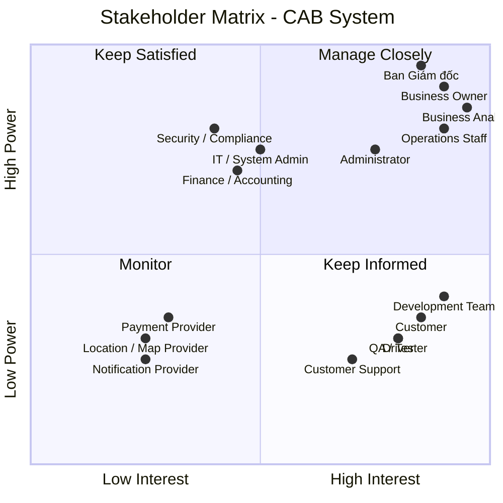

Bước 1 : đọc và phân tích yêu cầu sơ khởi của khách hàng ở giai đoạn 1 
ChatGPT đã nói:
Được. Nếu đưa lên GitHub Markdown, tôi khuyến nghị trình bày theo format tài liệu BA chuyên nghiệp, ngắn gọn và dễ review như sau:

CAB System – Phân tích yêu cầu sơ khởi
1. Mục tiêu dự án
Xây dựng nền tảng CAB System phục vụ toàn bộ vòng đời đặt xe:

Tạo yêu cầu → Tìm tài xế → Thực hiện chuyến → Tính cước → Thanh toán → Đánh giá → Quản trị & Báo cáo

Hệ thống cần có khả năng mở rộng, tích hợp với hệ thống bên ngoài và triển khai từng phần, đáp ứng định hướng phát triển lâu dài của doanh nghiệp.

2. Phạm vi nghiệp vụ
Nhóm người dùng / hệ thống	Chức năng chính
Customer	Đăng ký, đăng nhập, đặt xe, theo dõi chuyến, thanh toán, lịch sử, đánh giá
Driver	Quản lý hồ sơ/phương tiện, trạng thái hoạt động, nhận/từ chối chuyến, cập nhật trạng thái, chia sẻ vị trí
Operations	Quản lý khách hàng, tài xế, phương tiện, chuyến đi, giao dịch và xử lý sự cố
Administrator	Phân quyền và thực hiện các thao tác quản trị nhạy cảm
Payment Provider	Xử lý thanh toán điện tử
Notification Provider	Gửi thông báo qua các kênh được hỗ trợ
Location/GPS Service	Hỗ trợ định vị, tìm tài xế và tính ETA

3. Quy trình nghiệp vụ cốt lõi
Customer tạo Booking
        ↓
Hệ thống tìm Driver phù hợp
        ↓
Driver nhận chuyến
        ↓
Thực hiện chuyến
        ↓
Hoàn thành chuyến
        ↓
Tính cước
        ↓
Thanh toán
        ↓
Đánh giá
        ↓
Lưu lịch sử & báo cáo

Driver Matching
Đây là nghiệp vụ trọng tâm của hệ thống:

Xác định tài xế phù hợp dựa trên vị trí, trạng thái và tiêu chí vận hành.
Ưu tiên tài xế phù hợp và gần khách hàng.
Nếu tài xế từ chối hoặc không phản hồi, hệ thống tự động tìm tài xế tiếp theo.
Không yêu cầu khách hàng tạo lại booking.
Nếu không tìm được tài xế, hệ thống phải thông báo rõ ràng cho khách hàng.
4. Yêu cầu chức năng chính
Customer
Quản lý tài khoản.
Tạo và theo dõi booking.
Theo dõi tài xế và trạng thái chuyến.
Xem lịch sử và cước chuyến.
Thanh toán.
Đánh giá tài xế.
Driver
Quản lý hồ sơ và phương tiện.
Cập nhật trạng thái sẵn sàng.
Nhận/từ chối chuyến.
Cập nhật trạng thái chuyến.
Cập nhật vị trí.
Operations
Quản lý Customer, Driver, Vehicle.
Theo dõi chuyến đang diễn ra.
Hỗ trợ xử lý chuyến lỗi.
Tra cứu giao dịch.
Theo dõi hiệu quả vận hành.
Reporting & Audit
Số lượng chuyến.
Doanh thu.
Tỷ lệ hoàn thành.
Tỷ lệ hủy.
Hiệu quả tài xế.
Audit log cho các thao tác quan trọng.
5. Yêu cầu phi chức năng
Nhóm	Yêu cầu
Scalability	Có khả năng mở rộng độc lập khi tải tăng
Availability	Lỗi Payment/Notification không làm dừng toàn bộ hệ thống
Security	Bảo vệ dữ liệu cá nhân, vị trí, phương tiện và giao dịch
Authorization	Phân quyền chức năng quản trị
Auditability	Lưu vết các thao tác quan trọng
Extensibility	Dễ bổ sung dịch vụ, payment provider, notification provider
Deployability	Có thể triển khai chức năng mới từng phần
Maintainability	Hạn chế phụ thuộc giữa các thành phần

6. Business Rules sơ bộ
Chỉ Driver đủ điều kiện và đang sẵn sàng mới được nhận chuyến.
Driver được ưu tiên dựa trên vị trí và các tiêu chí vận hành.
Driver từ chối/timeout → tiếp tục tìm Driver khác.
Không có Driver phù hợp → thông báo Customer.
Fare được tính dựa trên loại dịch vụ và thông tin chuyến.
Thanh toán điện tử được xử lý thông qua External Payment Provider.
CAB không lưu trực tiếp thông tin thẻ/tài khoản nhạy cảm.
Chỉ chuyến hoàn thành mới đủ điều kiện để Customer đánh giá Driver.
Chức năng quản trị phải được kiểm soát bằng quyền.
Các thao tác quan trọng phải được ghi nhận vào Audit Log.
7. Các vấn đề cần làm rõ
Hiện tại một số Business Rules quan trọng chưa được khách hàng chốt:

#	Vấn đề cần xác nhận
1	Công thức tính cước, phụ phí và giá tối thiểu
2	Tiêu chí và cách thức ưu tiên Driver
3	Thời gian Driver phải phản hồi và cơ chế timeout
4	Chính sách hủy chuyến và phí hủy
5	Xử lý mất kết nối/GPS trong quá trình chuyến
6	Xử lý Payment thất bại, timeout và retry
7	Payment Provider và các phương thức thanh toán
8	Notification channels và cơ chế retry
9	Thời gian lưu trữ dữ liệu và lịch sử vị trí
10	SLA, performance target và quy mô tải dự kiến
11	Mô hình Role/Permission của nhân viên vận hành

8. Rủi ro chính
Driver Matching chưa có business rule cụ thể.
Fare Calculation chưa được xác định.
Chính sách Cancellation chưa rõ.
Phụ thuộc vào Payment/Notification Provider.
Realtime Location có thể tạo tải lớn.
Chưa xác định rõ SLA và quy mô người dùng.
Xử lý offline/network failure chưa được thống nhất.
9. Kết luận của BA
CAB System là nền tảng quản lý toàn bộ vòng đời chuyến xe, không chỉ đơn thuần là ứng dụng đặt xe.

Phạm vi nghiệp vụ chính đã được xác định tương đối rõ, tuy nhiên các Business Rules liên quan đến Fare, Driver Matching, Cancellation, Payment và Exception Handling vẫn cần được làm rõ trước khi khóa requirement.

Đề xuất bước tiếp theo
Requirement Clarification Workshop
→ Chốt Business Rules & Open Issues
→ Xây dựng Use Case / Business Process
→ Đặc tả Functional & Non-functional Requirements
→ Xây dựng Acceptance Criteria
→ Baseline Requirement
→ Chuyển sang Solution Design & Development.
Bước 2 : Tìm ra và xác nhận các stalkholder trong đây, chia làm 2 cột, cột thứ 1: tên của stakeholder, cột thứ 2: vai trò của nó, Sau đó vẽ 1 ma trận tên stakeholder matrix cho biết sự ảnh hưởng tầm quan trọng vai trò của stakeholder trong hệ thống
# BƯỚC 2 – XÁC ĐỊNH STAKEHOLDER

## 1. Stakeholder List

| Stakeholder | Vai trò |
|---|---|
| **Ban Giám đốc (Management)** | Định hướng chiến lược, phê duyệt phạm vi, ngân sách và các quyết định quan trọng của dự án. |
| **Business Owner / CAB Business Team** | Đại diện nghiệp vụ, xác định mục tiêu kinh doanh và chịu trách nhiệm về sản phẩm. |
| **Business Analyst (BA)** | Thu thập, phân tích, làm rõ và quản lý yêu cầu; kết nối Business với đội phát triển. |
| **Customer** | Đăng ký, đặt xe, theo dõi chuyến, thanh toán, xem lịch sử và đánh giá tài xế. |
| **Driver** | Quản lý hồ sơ/phương tiện, nhận chuyến, cập nhật trạng thái và vị trí. |
| **Operations Staff** | Quản lý khách hàng, tài xế, phương tiện, chuyến đi và xử lý các trường hợp phát sinh. |
| **Administrator** | Quản lý tài khoản, phân quyền và thực hiện các thao tác quản trị nhạy cảm. |
| **Finance / Accounting** | Quản lý doanh thu, giao dịch, đối soát và nghiệp vụ thanh toán. |
| **IT / System Administrator** | Quản lý hạ tầng, môi trường triển khai và vận hành hệ thống. |
| **Development Team** | Thiết kế, phát triển, tích hợp và bảo trì hệ thống. |
| **QA / Tester** | Kiểm thử chức năng, tích hợp, hiệu năng và đảm bảo chất lượng. |
| **Payment Provider** | Cung cấp dịch vụ thanh toán điện tử và xử lý kết quả giao dịch. |
| **Notification Provider** | Cung cấp các kênh gửi thông báo như Push, SMS, Email. |
| **Location / Map Provider** | Cung cấp dữ liệu bản đồ, định vị, khoảng cách và hỗ trợ tính ETA. |
| **Security / Compliance** | Đảm bảo các yêu cầu về bảo mật, quyền riêng tư và tuân thủ. |
| **Customer Support / Call Center** | Tiếp nhận và hỗ trợ các vấn đề phát sinh từ khách hàng và tài xế. |

---

## 2. Stakeholder Matrix

**Mục đích:** Đánh giá stakeholder dựa trên hai tiêu chí:

- **Power / Influence:** Mức độ ảnh hưởng và khả năng ra quyết định.
- **Interest:** Mức độ quan tâm và tham gia vào dự án.

### 3. Phân nhóm Stakeholder

| Nhóm | Cách quản lý | Stakeholder chính |
|---|---|---|
| **Manage Closely** | Tham gia thường xuyên, trao đổi và xác nhận các quyết định quan trọng | Management, Business Owner, Operations, BA, Administrator |
| **Keep Satisfied** | Duy trì sự hài lòng, cập nhật các vấn đề có ảnh hưởng | Finance, IT, Security/Compliance |
| **Keep Informed** | Cập nhật thường xuyên, thu thập phản hồi | Customer, Driver, Development, QA, Customer Support |
| **Monitor** | Theo dõi khi phát sinh vấn đề hoặc yêu cầu tích hợp | Payment, Notification, Location/Map Provider |

### 4. Kết luận

> **Nhóm cần ưu tiên cao nhất là Management, Business Owner, Operations, BA và Administrator**, vì có mức độ ảnh hưởng và mức độ tham gia cao đối với phạm vi, quy trình và quyết định của CAB System.
>
> Trong giai đoạn phân tích, BA cần đặc biệt phối hợp với **Business Owner, Operations, Customer, Driver, Finance và IT/Security** để xác nhận Business Rules, quy trình nghiệp vụ và các yêu cầu còn chưa rõ.

