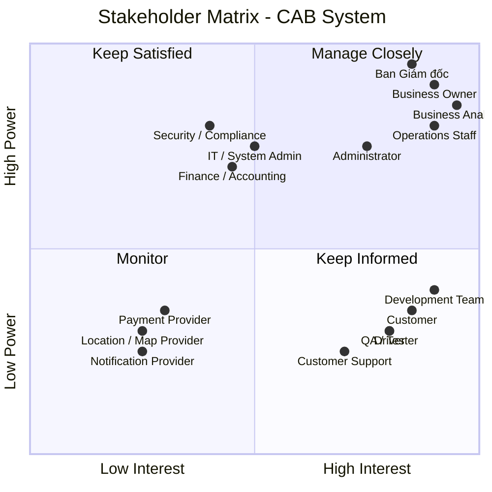
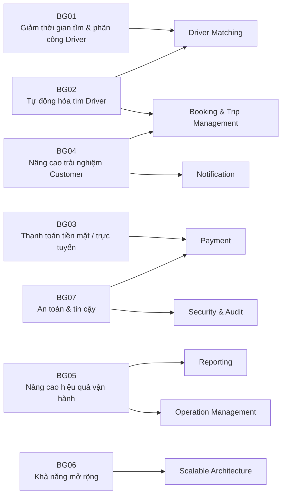
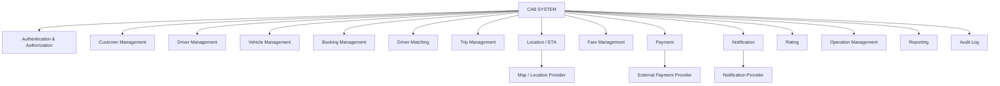
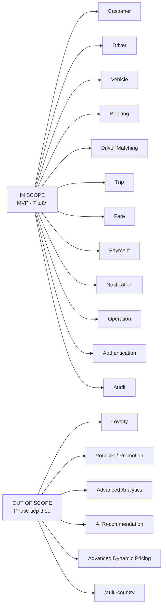
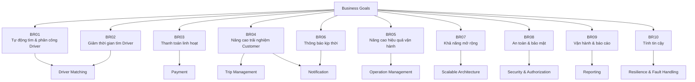

Bước 1 : đọc và phân tích yêu cầu sơ khởi của khách hàng ở giai đoạn 1 
# BƯỚC 1 – PHÂN TÍCH YÊU CẦU SƠ KHỞI

## 1. Mục tiêu dự án

Xây dựng **CAB System** – nền tảng đặt xe trực tuyến, quản lý toàn bộ vòng đời chuyến xe:

> **Tạo yêu cầu → Tìm tài xế → Phân công → Thực hiện chuyến → Tính cước → Thanh toán → Đánh giá → Báo cáo**

Hệ thống cần đáp ứng khả năng **mở rộng, tích hợp với hệ thống bên ngoài, bảo mật và triển khai từng phần**.

---

## 2. Phạm vi nghiệp vụ sơ bộ

| Nhóm | Phạm vi chính |
|---|---|
| **Customer** | Đăng ký, đăng nhập, cập nhật thông tin, đặt xe, theo dõi chuyến, thanh toán, xem lịch sử, đánh giá |
| **Driver** | Quản lý hồ sơ/phương tiện, trạng thái hoạt động, nhận/từ chối chuyến, cập nhật trạng thái và vị trí |
| **Operations** | Quản lý Customer, Driver, Vehicle, Trip; giám sát chuyến và xử lý sự cố |
| **Administration** | Phân quyền, quản lý chức năng nhạy cảm và audit |
| **Payment** | Tính cước, thanh toán tiền mặt và thanh toán điện tử |
| **Notification** | Gửi thông báo cho Customer và Driver |
| **Reporting** | Báo cáo chuyến, doanh thu, tỷ lệ hoàn thành, hủy và hiệu quả Driver |
| **Integration** | Payment Provider, Notification Provider, Location/Map Service |

---

## 3. Quy trình nghiệp vụ cốt lõi

```text
Customer
   │
   ▼
Tạo Booking
   │
   ▼
Tìm Driver phù hợp
   │
   ├── Driver từ chối/Timeout
   │          │
   │          └──────► Tìm Driver tiếp theo
   │
   ▼
Driver nhận chuyến
   │
   ▼
Thực hiện chuyến
   │
   ▼
Hoàn thành chuyến
   │
   ▼
Tính cước
   │
   ▼
Thanh toán
   │
   ▼
Đánh giá
   │
   ▼
Lưu lịch sử & Báo cáo
```

### Driver Matching

Đây là nghiệp vụ trọng tâm:

- Xác định Driver dựa trên **vị trí, trạng thái sẵn sàng và tiêu chí vận hành**.
- Ưu tiên Driver phù hợp và gần Customer.
- Nếu Driver **từ chối hoặc không phản hồi**, hệ thống tự động tìm Driver tiếp theo.
- Customer không cần tạo lại Booking.
- Nếu không tìm được Driver, hệ thống phải thông báo rõ ràng.

---

## 4. Yêu cầu chức năng chính

### Customer

- Đăng ký / đăng nhập.
- Quản lý thông tin cá nhân.
- Tạo Booking.
- Theo dõi Driver và trạng thái Trip.
- Xem lịch sử và cước.
- Thanh toán.
- Đánh giá Driver.

### Driver

- Quản lý hồ sơ và phương tiện.
- Cập nhật trạng thái sẵn sàng.
- Nhận / từ chối chuyến.
- Cập nhật trạng thái Trip.
- Cập nhật vị trí.

### Operations

- Quản lý Customer, Driver, Vehicle.
- Theo dõi Trip đang diễn ra.
- Xử lý Trip lỗi.
- Tra cứu giao dịch.
- Theo dõi hiệu quả hoạt động.

### Reporting & Audit

- Số lượng Trip.
- Doanh thu.
- Tỷ lệ hoàn thành.
- Tỷ lệ hủy.
- Hiệu quả Driver.
- Audit Log.

---

## 5. Yêu cầu phi chức năng

| Nhóm | Yêu cầu |
|---|---|
| **Scalability** | Có khả năng mở rộng độc lập khi tải tăng |
| **Availability** | Lỗi Payment/Notification không làm dừng toàn bộ hệ thống |
| **Security** | Bảo vệ dữ liệu cá nhân, phương tiện, vị trí và giao dịch |
| **Authorization** | Kiểm soát quyền truy cập chức năng quản trị |
| **Auditability** | Lưu vết các thao tác quan trọng |
| **Extensibility** | Có thể bổ sung dịch vụ, Payment Provider, Notification Provider |
| **Maintainability** | Hạn chế phụ thuộc giữa các thành phần |
| **Deployability** | Cho phép triển khai chức năng mới từng phần |

---

## 6. Business Rules sơ bộ

| ID | Business Rule |
|---|---|
| **BR-01** | Chỉ Driver đủ điều kiện và đang sẵn sàng mới được nhận chuyến. |
| **BR-02** | Driver phải phù hợp với loại xe/dịch vụ Customer yêu cầu. |
| **BR-03** | Hệ thống ưu tiên Driver phù hợp và gần Customer. |
| **BR-04** | Driver từ chối hoặc Timeout → hệ thống tìm Driver tiếp theo. |
| **BR-05** | Không tìm được Driver → thông báo Customer. |
| **BR-06** | Fare được xác định dựa trên loại dịch vụ và thông tin chuyến. |
| **BR-07** | Payment điện tử được xử lý thông qua External Payment Provider. |
| **BR-08** | CAB không lưu trực tiếp thông tin thẻ/tài khoản nhạy cảm. |
| **BR-09** | Customer chỉ được đánh giá sau khi Trip hoàn thành. |
| **BR-10** | Chức năng quản trị phải được kiểm soát bằng quyền. |
| **BR-11** | Các thao tác quan trọng phải được ghi nhận Audit Log. |

> **Lưu ý:** Các Business Rules trên mới là **sơ bộ**, cần được xác nhận với Stakeholder trước khi trở thành Baseline Requirement.

---

## 7. Các vấn đề cần làm rõ

| # | Open Issue / Question |
|---:|---|
| 1 | Công thức tính cước, phụ phí và giá tối thiểu là gì? |
| 2 | Tiêu chí và thuật toán ưu tiên Driver như thế nào? |
| 3 | Driver có bao nhiêu thời gian để phản hồi? |
| 4 | Chính sách hủy chuyến và phí hủy như thế nào? |
| 5 | Xử lý mất kết nối/GPS trong quá trình chuyến ra sao? |
| 6 | Payment thất bại, Timeout và Retry được xử lý thế nào? |
| 7 | Payment Provider và phương thức thanh toán nào được sử dụng? |
| 8 | Notification Channel nào được hỗ trợ trong MVP? |
| 9 | Thời gian lưu trữ Trip, Location, Payment và Audit Log? |
| 10 | SLA, Performance Target và quy mô tải dự kiến? |
| 11 | Mô hình Role/Permission của Operations và Administrator? |

---

## 8. Rủi ro chính

| Rủi ro | Mức độ |
|---|---|
| Fare Calculation chưa được xác định | 🔴 Cao |
| Driver Matching chưa có tiêu chí cụ thể | 🔴 Cao |
| Cancellation Policy chưa rõ | 🔴 Cao |
| Payment Provider chưa xác định | 🔴 Cao |
| Performance/SLA chưa xác định | 🔴 Cao |
| Realtime Location có thể tạo tải lớn | 🔴 Cao |
| Xử lý Network Failure chưa thống nhất | 🔴 Cao |
| Notification/Payment phụ thuộc hệ thống bên ngoài | 🟠 Trung bình - Cao |
| Data Retention chưa xác định | 🟠 Trung bình |

---

## 9. Kết luận của BA

**CAB System không chỉ là ứng dụng đặt xe mà là nền tảng quản lý toàn bộ vòng đời chuyến xe.**

Phạm vi nghiệp vụ chính đã tương đối rõ, tuy nhiên cần xác nhận các Business Rules quan trọng trước khi khóa Requirement, đặc biệt:

> **Fare → Driver Matching → Timeout → Cancellation → Payment Failure → Network Failure → Data Retention**

### Đề xuất bước tiếp theo

```text
Requirement Clarification Workshop
              ↓
Xác nhận Business Rules & Open Issues
              ↓
Use Case & Business Process
              ↓
Functional / Non-functional Requirements
              ↓
Acceptance Criteria
              ↓
Requirement Baseline
              ↓
Solution Design & Development
```

### Deliverables của giai đoạn phân tích

- [x] Scope & Business Context
- [x] Preliminary Functional Requirements
- [x] Preliminary Non-functional Requirements
- [x] Business Rules
- [x] Exception / Edge Cases
- [x] Open Questions
- [x] Risks & Dependencies
- [ ] Stakeholder Analysis
- [ ] Use Case Diagram
- [ ] Detailed Use Case Specification
- [ ] Acceptance Criteria
- [ ] Requirement Baseline

Bước 2 : Tìm ra và xác nhận các stalkholder trong đây, chia làm 2 cột, cột thứ 1: tên của stakeholder, cột thứ 2: vai trò của nó, Sau đó vẽ 1 ma trận tên stakeholder matrix cho biết sự ảnh hưởng tầm quan trọng vai trò của stakeholder trong hệ thống
# BƯỚC 2 – XÁC ĐỊNH STAKEHOLDER

## 1. Stakeholder List

| Stakeholder | Vai trò |
|---|---|
| **Ban Giám đốc (Management)** | Định hướng chiến lược, phê duyệt phạm vi, ngân sách và các quyết định quan trọng của dự án. |
| **Business Owner / CAB Business Team** | Đại diện nghiệp vụ, xác định mục tiêu kinh doanh và chịu trách nhiệm về sản phẩm. |
| **Business Analyst (BA)** | Thu thập, phân tích, làm rõ và quản lý yêu cầu; kết nối Business với đội phát triển. |
| **Customer** | Đăng ký, đặt xe, theo dõi chuyến, thanh toán, xem lịch sử và đánh giá tài xế. |
| **Driver** | Quản lý hồ sơ/phương tiện, nhận chuyến, cập nhật trạng thái và vị trí. |
| **Operations Staff** | Quản lý khách hàng, tài xế, phương tiện, chuyến đi và xử lý các trường hợp phát sinh. |
| **Administrator** | Quản lý tài khoản, phân quyền và thực hiện các thao tác quản trị nhạy cảm. |
| **Finance / Accounting** | Quản lý doanh thu, giao dịch, đối soát và nghiệp vụ thanh toán. |
| **IT / System Administrator** | Quản lý hạ tầng, môi trường triển khai và vận hành hệ thống. |
| **Development Team** | Thiết kế, phát triển, tích hợp và bảo trì hệ thống. |
| **QA / Tester** | Kiểm thử chức năng, tích hợp, hiệu năng và đảm bảo chất lượng. |
| **Payment Provider** | Cung cấp dịch vụ thanh toán điện tử và xử lý kết quả giao dịch. |
| **Notification Provider** | Cung cấp các kênh gửi thông báo như Push, SMS, Email. |
| **Location / Map Provider** | Cung cấp dữ liệu bản đồ, định vị, khoảng cách và hỗ trợ tính ETA. |
| **Security / Compliance** | Đảm bảo các yêu cầu về bảo mật, quyền riêng tư và tuân thủ. |
| **Customer Support / Call Center** | Tiếp nhận và hỗ trợ các vấn đề phát sinh từ khách hàng và tài xế. |

---

## 2. Stakeholder Matrix

**Mục đích:** Đánh giá stakeholder dựa trên hai tiêu chí:

- **Power / Influence:** Mức độ ảnh hưởng và khả năng ra quyết định.
- **Interest:** Mức độ quan tâm và tham gia vào dự án.



### 3. Phân nhóm Stakeholder

| Nhóm | Cách quản lý | Stakeholder chính |
|---|---|---|
| **Manage Closely** | Tham gia thường xuyên, trao đổi và xác nhận các quyết định quan trọng | Management, Business Owner, Operations, BA, Administrator |
| **Keep Satisfied** | Duy trì sự hài lòng, cập nhật các vấn đề có ảnh hưởng | Finance, IT, Security/Compliance |
| **Keep Informed** | Cập nhật thường xuyên, thu thập phản hồi | Customer, Driver, Development, QA, Customer Support |
| **Monitor** | Theo dõi khi phát sinh vấn đề hoặc yêu cầu tích hợp | Payment, Notification, Location/Map Provider |

### 4. Kết luận

> **Nhóm cần ưu tiên cao nhất là Management, Business Owner, Operations, BA và Administrator**, vì có mức độ ảnh hưởng và mức độ tham gia cao đối với phạm vi, quy trình và quyết định của CAB System.
>
> Trong giai đoạn phân tích, BA cần đặc biệt phối hợp với **Business Owner, Operations, Customer, Driver, Finance và IT/Security** để xác nhận Business Rules, quy trình nghiệp vụ và các yêu cầu còn chưa rõ.
Bước 3: xác định  bussines goal ,BG01 là cái gì, BG02 là cái gì, làm giảm thời gian tự động tìm tài xế ,mục đích hệ thống có chức năng tìm tài xế, hỗ trợ cho phép thanh toán bằng tiền mặt hoặc trực tuyến 
# BƯỚC 3 – XÁC ĐỊNH BUSINESS GOALS

## 1. Business Goals

| ID | Business Goal | Mục tiêu |
|---|---|---|
| **BG01** | **Giảm thời gian tìm và phân công tài xế** | Tự động hóa quá trình tìm kiếm và phân công tài xế phù hợp, giảm thời gian chờ của khách hàng và hạn chế phân công thủ công. |
| **BG02** | **Tự động hóa quy trình tìm tài xế** | Tự động tìm, ưu tiên và phân công tài xế dựa trên vị trí, trạng thái sẵn sàng và các tiêu chí vận hành. |
| **BG03** | **Đa dạng hóa phương thức thanh toán** | Hỗ trợ khách hàng thanh toán bằng **tiền mặt hoặc thanh toán điện tử**. |
| **BG04** | **Nâng cao trải nghiệm khách hàng** | Cho phép khách hàng theo dõi trạng thái chuyến, thông tin tài xế và thời gian dự kiến đến. |
| **BG05** | **Nâng cao hiệu quả vận hành** | Hỗ trợ quản lý khách hàng, tài xế, phương tiện, chuyến đi, giao dịch và báo cáo. |
| **BG06** | **Xây dựng nền tảng CAB có khả năng mở rộng** | Cho phép mở rộng số lượng người dùng, tài xế, chuyến đi và bổ sung các dịch vụ mới trong tương lai. |
| **BG07** | **Đảm bảo an toàn và tin cậy** | Bảo vệ dữ liệu người dùng, vị trí và giao dịch; hạn chế ảnh hưởng khi Payment hoặc Notification gặp lỗi. |

---

## 2. Ưu tiên Business Goals

| Priority | Business Goal | Mức độ |
|---|---|---|
| **P1** | BG01 – Giảm thời gian tìm và phân công tài xế | 🔴 Critical |
| **P1** | BG02 – Tự động hóa tìm tài xế | 🔴 Critical |
| **P1** | BG03 – Hỗ trợ thanh toán tiền mặt / trực tuyến | 🔴 Critical |
| **P1** | BG04 – Nâng cao trải nghiệm khách hàng | 🔴 Critical |
| **P2** | BG05 – Nâng cao hiệu quả vận hành | 🟠 High |
| **P2** | BG06 – Khả năng mở rộng | 🟠 High |
| **P2** | BG07 – An toàn và tin cậy | 🟠 High |

---

## 3. Liên kết Business Goal với chức năng hệ thống



---

## 4. Kết luận

> **Ba Business Goals cốt lõi của dự án CAB:**
>
> - **BG01:** Giảm thời gian tìm và phân công tài xế.
> - **BG02:** Tự động hóa quá trình tìm và phân công tài xế.
> - **BG03:** Hỗ trợ thanh toán linh hoạt bằng tiền mặt và trực tuyến.

Các Business Goals là cơ sở để BA tiếp tục xác định:

**Business Goal → Business Requirement → Functional Requirement → Use Case → Acceptance Criteria**

bước 4 : xác định cái phạm vi yêu cầu để thực hiện, ví dụ, quản lý khách hàng, quản lý tài xế, xác định các mô đun cơ bản , quản lý trong bảng MBB,xác định nên làm cái gì và các cái gì không nên làm, làm theo dạng markdow
# BƯỚC 4 – XÁC ĐỊNH PHẠM VI VÀ MODULE HỆ THỐNG

## 1. Mục tiêu

Xác định phạm vi triển khai **CAB System trong 7 tuần**, bao gồm:

- Các chức năng bắt buộc phải thực hiện.
- Các chức năng nên thực hiện nếu còn thời gian.
- Các chức năng có thể phát triển ở giai đoạn sau.
- Các chức năng chưa thực hiện trong phạm vi hiện tại.

---

## 2. Phạm vi hệ thống

### 2.1. In Scope – Trong phạm vi

| # | Module | Phạm vi chính |
|---:|---|---|
| 1 | **Quản lý Customer** | Đăng ký, đăng nhập, cập nhật thông tin, xem lịch sử chuyến |
| 2 | **Quản lý Driver** | Hồ sơ, trạng thái hoạt động, nhận/từ chối chuyến |
| 3 | **Quản lý Vehicle** | Thông tin phương tiện, loại xe, trạng thái phương tiện |
| 4 | **Booking Management** | Tạo, xem và theo dõi yêu cầu đặt xe |
| 5 | **Driver Matching** | Tìm, ưu tiên và phân công Driver tự động |
| 6 | **Trip Management** | Quản lý trạng thái và vòng đời chuyến đi |
| 7 | **Location / ETA** | Cập nhật vị trí Driver và hỗ trợ tính ETA |
| 8 | **Fare Management** | Tính và xác định cước chuyến |
| 9 | **Payment** | Thanh toán tiền mặt và thanh toán điện tử |
| 10 | **Notification** | Thông báo trạng thái Booking, Trip và Payment |
| 11 | **Rating** | Customer đánh giá Driver sau chuyến |
| 12 | **Operation Management** | Theo dõi và xử lý Customer, Driver, Vehicle, Trip |
| 13 | **Reporting** | Báo cáo chuyến, doanh thu, hoàn thành, hủy |
| 14 | **Authentication & Authorization** | Đăng nhập, xác thực và phân quyền |
| 15 | **Audit Log** | Lưu vết các thao tác quan trọng |

---

## 3. Module cơ bản của hệ thống



---

# 4. Phân loại phạm vi theo MBB

> **MBB = Must / Should / Could / Won't**

| MBB | Module / Chức năng | Phạm vi thực hiện |
|---|---|---|
| **M – Must** | Customer Management | Đăng ký, đăng nhập, cập nhật hồ sơ |
| **M – Must** | Driver Management | Hồ sơ, trạng thái sẵn sàng, nhận/từ chối chuyến |
| **M – Must** | Vehicle Management | Quản lý thông tin phương tiện |
| **M – Must** | Booking Management | Tạo và quản lý Booking |
| **M – Must** | Driver Matching | Tự động tìm và phân công Driver |
| **M – Must** | Trip Management | Quản lý trạng thái chuyến |
| **M – Must** | Fare Management | Tính cước chuyến |
| **M – Must** | Payment | Tiền mặt và thanh toán điện tử |
| **M – Must** | Notification | Thông báo các trạng thái quan trọng |
| **M – Must** | Authentication / Authorization | Xác thực và phân quyền |
| **M – Must** | Audit Log | Lưu vết thao tác quan trọng |
| **S – Should** | Location / ETA | Theo dõi vị trí và thời gian dự kiến |
| **S – Should** | Rating | Đánh giá Driver sau chuyến |
| **S – Should** | Operation Management | Dashboard và xử lý các trường hợp Trip lỗi |
| **S – Should** | Basic Reporting | Báo cáo chuyến, doanh thu, hoàn thành, hủy |
| **C – Could** | Advanced Reporting | Dashboard phân tích chuyên sâu |
| **C – Could** | Advanced Driver Ranking | Xếp hạng Driver nâng cao |
| **C – Could** | Notification đa kênh nâng cao | Mở rộng nhiều provider/kênh |
| **C – Could** | Khuyến mãi / Voucher | Coupon, promotion |
| **C – Could** | Loyalty / Membership | Điểm thưởng, hạng thành viên |
| **W – Won't** | Tính năng ngoài phạm vi MVP | Chưa triển khai trong giai đoạn 7 tuần |

---

## 5. Những nội dung KHÔNG nên làm trong giai đoạn hiện tại

Để đảm bảo tiến độ **7 tuần**, các chức năng sau nên đưa ra ngoài phạm vi MVP:

| Chức năng | Lý do |
|---|---|
| **Loyalty / Membership** | Không ảnh hưởng đến quy trình đặt xe cốt lõi |
| **Voucher / Promotion** | Cần thêm nhiều Business Rules và logic tính giá |
| **Advanced Analytics** | Không phải chức năng bắt buộc để vận hành MVP |
| **AI Driver Recommendation** | Có thể phát triển sau khi có đủ dữ liệu thực tế |
| **Dynamic Pricing nâng cao** | Fare Policy hiện chưa được khách hàng chốt |
| **Multi-service phức tạp** | Chưa cần thiết trong phiên bản đầu |
| **Nhiều Payment Provider** | MVP chỉ cần tích hợp Provider được thống nhất |
| **Nhiều Notification Provider** | Thiết kế mở rộng nhưng chưa cần triển khai tất cả |
| **International / Multi-country** | Chưa có yêu cầu kinh doanh |
| **Advanced Customer Loyalty** | Không thuộc quy trình đặt xe cốt lõi |

> **Lưu ý:** "Won't" không có nghĩa là hệ thống không bao giờ hỗ trợ. Đây là các chức năng **chưa thực hiện trong phạm vi phiên bản hiện tại** và có thể đưa vào các phase tiếp theo.

---

# 6. Phạm vi ưu tiên cho 7 tuần

### Phase 1 – Core Foundation

- Authentication
- Customer Management
- Driver Management
- Vehicle Management
- Booking Management

### Phase 2 – Core Ride

- Driver Matching
- Trip Management
- Location / ETA
- Notification

### Phase 3 – Payment & Operation

- Fare Management
- Payment
- Operation Management
- Rating

### Phase 4 – Reporting & Stabilization

- Basic Reporting
- Audit Log
- Integration Testing
- Performance Testing
- Security Testing
- Bug Fixing & Deployment

---

## 7. Scope Boundary



---

# 8. Kết luận phạm vi

### Must Have – Bắt buộc

> **Customer → Driver → Vehicle → Booking → Driver Matching → Trip → Fare → Payment → Notification → Operation → Authentication → Audit**

Đây là **core scope** cần ưu tiên để đảm bảo hệ thống có thể vận hành được trong 7 tuần.

### Should Have – Nên có

> **Location / ETA → Rating → Operation Dashboard → Basic Reporting**

Các chức năng này nâng cao trải nghiệm và hiệu quả vận hành nhưng có thể điều chỉnh ưu tiên theo tiến độ.

### Could Have – Có thể phát triển sau

> **Advanced Reporting → Voucher → Loyalty → AI Recommendation → Advanced Dynamic Pricing**

### Won't Have – Chưa thực hiện

> Các tính năng không ảnh hưởng đến **core booking flow** và chưa có yêu cầu kinh doanh rõ ràng sẽ được đưa sang **Phase 2 / Future Release**.

---

## 9. Nguyên tắc kiểm soát Scope

> **Ưu tiên hoàn thành End-to-End Core Flow trước:**

**Customer tạo Booking → Driver Matching → Driver nhận chuyến → Trip Completed → Fare → Payment → Notification**

Nếu tiến độ bị ảnh hưởng, các chức năng thuộc nhóm **Could Have** sẽ được cắt giảm trước, **không cắt các chức năng Must Have của Core Flow**.
Bước 5 : sau khi xác nhận với khách hàng rồi chuyển các yêu cầu thành bussines requirement, mối busines requirement kí hiệu là BG, BG01 là gì, BG02 là gì, BG03 là gì, lập 1 bảng  cột thứ nhất là mã với số thứ tự,cột thứ 2 là tên,cột thứ 3 là diễn giải ra 
# BƯỚC 5 – XÁC ĐỊNH BUSINESS REQUIREMENTS

## 1. Business Requirements

Sau khi phân tích và xác nhận yêu cầu với khách hàng, các mục tiêu kinh doanh được chuyển thành các **Business Requirements (BR)** để làm cơ sở cho việc phân rã thành Functional Requirements và Use Cases.

| Mã | Tên Business Requirement | Diễn giải |
|---|---|---|
| **BR01** | **Tự động tìm và phân công tài xế** | Hệ thống phải tự động tìm kiếm và phân công tài xế phù hợp dựa trên vị trí, trạng thái sẵn sàng và các tiêu chí vận hành đã xác định. |
| **BR02** | **Giảm thời gian tìm tài xế** | Hệ thống phải giảm thời gian từ khi khách hàng tạo yêu cầu đến khi tìm được tài xế; nếu tài xế từ chối hoặc không phản hồi, hệ thống phải tiếp tục tìm tài xế khác. |
| **BR03** | **Hỗ trợ thanh toán linh hoạt** | Hệ thống phải cho phép khách hàng thanh toán bằng tiền mặt hoặc phương thức thanh toán điện tử thông qua nhà cung cấp thanh toán bên ngoài. |
| **BR04** | **Nâng cao trải nghiệm khách hàng** | Hệ thống phải cho phép khách hàng theo dõi trạng thái chuyến, thông tin tài xế, thời gian dự kiến đến, số tiền phải trả và lịch sử chuyến đi. |
| **BR05** | **Nâng cao hiệu quả vận hành** | Hệ thống phải hỗ trợ nhân viên vận hành quản lý khách hàng, tài xế, phương tiện, chuyến đi, giao dịch và xử lý các trường hợp phát sinh. |
| **BR06** | **Cung cấp thông báo kịp thời** | Hệ thống phải thông báo cho khách hàng và tài xế về các sự kiện quan trọng như tiếp nhận Booking, nhận chuyến, tài xế đến điểm đón, hoàn thành chuyến và kết quả thanh toán. |
| **BR07** | **Đảm bảo khả năng mở rộng** | Hệ thống phải có khả năng mở rộng số lượng khách hàng, tài xế và chuyến đi; đồng thời cho phép bổ sung dịch vụ, phương thức thanh toán và kênh thông báo trong tương lai. |
| **BR08** | **Đảm bảo an toàn và bảo mật** | Hệ thống phải bảo vệ thông tin cá nhân, thông tin phương tiện, dữ liệu vị trí và dữ liệu giao dịch; đồng thời kiểm soát quyền truy cập các chức năng quản trị. |
| **BR09** | **Đảm bảo khả năng vận hành và báo cáo** | Hệ thống phải cung cấp dữ liệu và báo cáo về số lượng chuyến, doanh thu, tỷ lệ hoàn thành, tỷ lệ hủy và hiệu quả hoạt động của tài xế. |
| **BR10** | **Đảm bảo tính tin cậy của hệ thống** | Lỗi tại Payment hoặc Notification không được làm gián đoạn toàn bộ hệ thống đặt xe; hệ thống phải có cơ chế xử lý lỗi phù hợp. |

---

## 2. Business Requirement Priority

| Mã | Priority | Mức độ |
|---|---|---|
| **BR01** | P1 | Critical |
| **BR02** | P1 | Critical |
| **BR03** | P1 | Critical |
| **BR04** | P1 | Critical |
| **BR05** | P1 | Critical |
| **BR06** | P1 | Critical |
| **BR07** | P2 | High |
| **BR08** | P1 | Critical |
| **BR09** | P2 | High |
| **BR10** | P1 | Critical |

---

## 3. Phân rã Business Requirement



---

## 4. Kết luận

Các **Business Requirements (BR)** là cơ sở để tiếp tục phân rã thành:

```text
Business Goal (BG)
        ↓
Business Requirement (BR)
        ↓
Functional Requirement (FR)
        ↓
Use Case (UC)
        ↓
Acceptance Criteria (AC)
        ↓
Test Case
```

> **Quy ước mã:**
>
> - **BGxx** → Business Goal
> - **BRxx** → Business Requirement
> - **FRxx** → Functional Requirement
> - **NFRxx** → Non-functional Requirement
> - **UCxx** → Use Case
> - **ACxx** → Acceptance Criteria


